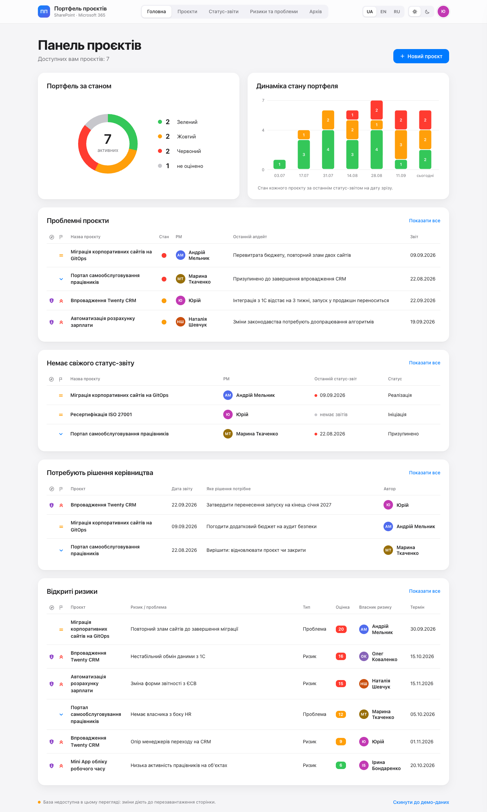

# Портфель проєктів

Портал управления портфелем проектов компании на SharePoint Online (Microsoft 365) и в Microsoft Teams.



## Что это

- **Карточка проекта:** участники, сроки, бюджет, состояние, история изменений, комментарии, отчёты и риски.
- **Статус-отчёты:** PM оценивает сроки, бюджет и ресурсы. Общее состояние — худшая из трёх оценок. Ключевые показатели проекта меняются только через отчёт, причина изменения обязательна.
- **Риски и проблемы:** оценка = вероятность × влияние (1–25).
- **Главная для руководства:** портфель по состоянию, динамика за 12 недель (7 срезов раз в две недели), проблемные проекты, проекты без свежего отчёта, запросы на решение, открытые риски.
- **Архив:** отчёт «Завершено» переводит проект в архив, дальше — только чтение.
- **Права по иерархии Entra ID:** проект видят его участники и их руководители вверх по цепочке; править проект, отчёты и риски может только PM, остальные смотрят и комментируют. Новые проекты заводит PMO. Остальные проект не видят.
- **Три языка** (UA / EN / RU), светлая и тёмная темы.

Полное техническое задание — [docs/SPEC.md](docs/SPEC.md). Прототип и скриншоты экранов — [docs/PROTOTYPE.md](docs/PROTOTYPE.md).

## Как устроено

```
 Пользователь ──► Приложение SPFx (React) ──REST от имени пользователя──► Списки SharePoint
                  главная сайта / Teams                                   Проєкти, Статус-звіти,
                  пишет: проекты, отчёты,                                 Ризики, Коментарі,
                  риски, комментарии                                      Зміни показників
                                                                               ▲
 По расписанию ──► Invoke-PMOSync.ps1 (app-only, сертификат) ─────────────────┘
                   отчёт → карточка, архив, журнал, права, напоминания
```

- **Данные** — только в списках SharePoint сайта `/sites/pmo`. Внешних баз и сервисов нет, Power Automate и Power Apps не используются.
- **Приложение** (`spfx/`, SPFx 1.23 + React 17) — интерфейс по прототипу. Оно работает от имени пользователя, поэтому каждый видит только свои проекты. Сохранённое видно на экране сразу: приложение накладывает ещё не перенесённые отчёты по тем же правилам, что и синхронизация.
- **Синхронизация** (`scripts/Invoke-PMOSync.ps1`, каждые 10–15 минут) — единственный механизм, который пишет ключевые показатели, журнал и права.
- **Развёртывание** (`scripts/Deploy-PMO.ps1`, `scripts/Deploy-App.ps1`) — идемпотентные скрипты PnP.PowerShell: сайт, списки, поля, переводы, права списков, представления, установка приложения.
- **Одинаковость правил** PowerShell и TypeScript проверяют общие тест-векторы `tests/cases/*.json`.

## Структура репозитория

| Путь | Что это |
|---|---|
| `spfx/` | Приложение SPFx: `logic/` — правила (с тестами Jest), `data/` — чтение и запись SharePoint, `components/`, `pages/`, `panels/` (карточка и формы), `i18n/`, `theme/` |
| `scripts/Deploy-PMO.ps1` | Сайт, списки, поля, переводы, права списков, представления |
| `scripts/Deploy-App.ps1` | Сборка приложения и установка на сайт, страница `Portal` — главная |
| `scripts/Invoke-PMOSync.ps1` | Синхронизация по расписанию |
| `scripts/Register-PMOApps.ps1` | Регистрация приложений Entra ID (выполняет администратор) |
| `scripts/Invoke-Env.ps1` | Единая точка запуска с параметрами окружения из `config/environments.json` |
| `scripts/Seed-TestData.ps1` | Демонстрационные данные для тестового сайта |
| `scripts/spfx.sh` | Команды в `spfx/` под Node 22 |
| `tests/` | `Test-Scripts.ps1` — проверки скриптов без SharePoint; `cases/` — общие тест-векторы |
| `prototype/pmo-prototype.html` | Интерактивный прототип — эталон интерфейса |
| `docs/SPEC.md` | Техническое задание |
| `docs/PROTOTYPE.md` | Прототип: как открыть, скриншоты экранов |
| `docs/USER-GUIDE.uk.md`, `.en.md`, `.ru.md` | Инструкция пользователя на трёх языках; она же — «Довідка» в приложении (`scripts/spfx.sh npm run guide`) |
| `docs/DEPLOYMENT.md` | Установка, синхронизация, доступ, расписание |
| `docs/SETUP-CLAUDE-CODE.md` | Подключение проекта к Claude Code |
| `docs/superpowers/` | Проектное решение по приложению и планы этапов |
| `CLAUDE.md` | Правила работы Claude Code с репозиторием |
| `CHANGELOG.md` | История изменений |

## Окружения

| Окружение | Сайт | Правила |
|---|---|---|
| `test` | `/sites/pmo-test` | вход по сертификату, можно работать самостоятельно |
| `prod` | `/sites/pmo` | только после явного подтверждения, вход через браузер |

## Быстрый старт

Нужны PowerShell 7.2+, модуль PnP.PowerShell и Node 22 (`brew install node@22`). Подробно — [docs/DEPLOYMENT.md](docs/DEPLOYMENT.md).

```bash
cp config/environments.example.json config/environments.json   # заполнить; файл не попадает в git
pwsh -NoLogo -File tests/Test-Scripts.ps1                      # проверки скриптов
scripts/spfx.sh npm ci && scripts/spfx.sh npm run test:unit     # тесты приложения
pwsh -NoLogo -File scripts/Invoke-Env.ps1 -Env test -Action deploy        # списки и поля
pwsh -NoLogo -File scripts/Invoke-Env.ps1 -Env test -Action app           # приложение
pwsh -NoLogo -File scripts/Invoke-Env.ps1 -Env test -Action seed          # демо-данные
pwsh -NoLogo -File scripts/Invoke-Env.ps1 -Env test -Action sync-dryrun   # пробная синхронизация
```

## Порядок изменений

Ветка `change/<кратко>` → прототип, скрипты, приложение и документация меняются вместе → тесты → тест-сайт → ревью человеком → `git push` → прод после отдельного «да». Подробно — [CLAUDE.md](CLAUDE.md).

## Состояние

| Этап | Состояние |
|---|---|
| Списки, синхронизация, права, развёртывание | готово |
| Приложение: каркас и главная | готово, `pmo-test` |
| Приложение: проекты, отчёты, риски, архив, карточка | готово, `pmo-test` |
| Приложение: формы и запись | готово, `pmo-test` |
| Доступ в карточке, Teams, регистрация синхронизации, прод | впереди |
