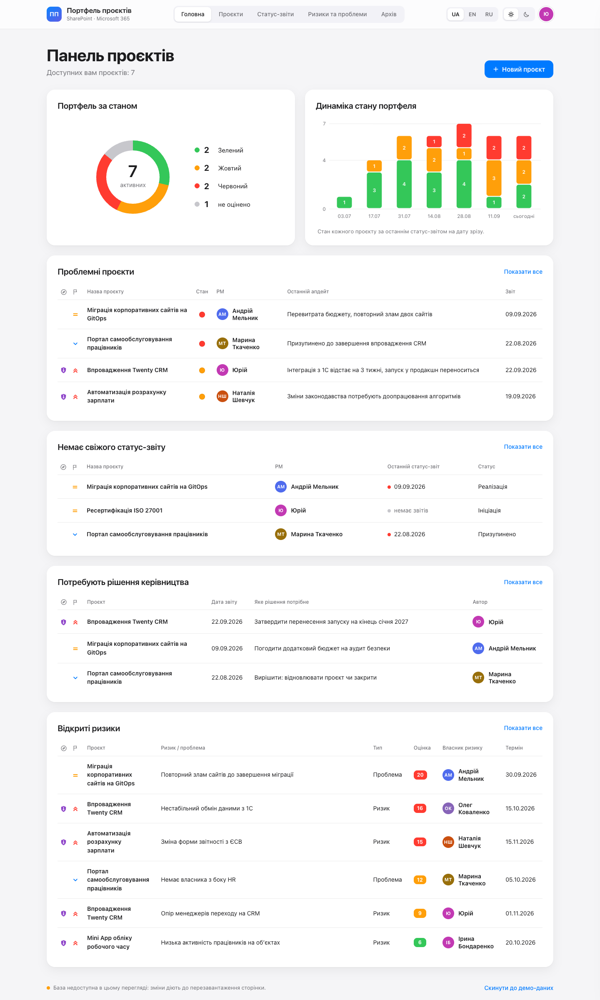
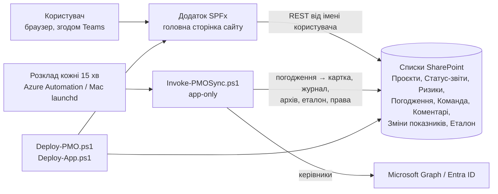

# PPM — Портфель проєктів

PPM (Project Portfolio Management) — портал управління портфелем проєктів компанії на SharePoint Online (Microsoft 365). Картка проєкту, статус-звіти з погодженням PMO, ризики, журнал змін, права за ієрархією Entra ID, головна для керівництва. Три мови інтерфейсу (UA / EN / RU), світла й темна теми.



## Що вміє

- **Картка проєкту:** PM, власник, команда з ролями, посилання, терміни, бюджет, стан, історія змін, коментарі, звіти, ризики, «Доступ до картки».
- **Статус-звіти:** PM оцінює терміни, бюджет і ресурси; загальний стан — найгірша з трьох оцінок. Ключові показники проєкту (статус, стан, тип, %, дати, витрати) змінюються лише погодженим PMO звітом; причина зміни обов'язкова.
- **Погодження PMO:** погодити як є, погодити зі зміною оцінок (з коментарем) або повернути на доопрацювання. Один звіт на погодженні на проєкт.
- **Ризики та проблеми:** оцінка = ймовірність × вплив (1–25), стратегія реагування, заходи, план дій.
- **Головна:** портфель за станом, динаміка за 12 тижнів, карта ризиків, напрями, зсуви термінів, запуски, проблемні проєкти, проєкти без свіжого звіту, запити на рішення.
- **Архів:** звіт зі статусом «Завершено» чи «Скасовано» переводить проєкт в архів — далі лише перегляд.
- **Доступ:** проєкт бачать його учасники та їхні керівники вгору по ланцюжку Entra ID; правити може лише PM; нові проєкти заводить PMO; інші проєкт не бачать.

Вимоги — [docs/SPEC.md](docs/SPEC.md), прототип і скриншоти — [docs/PROTOTYPE.md](docs/PROTOTYPE.md).

## Як влаштовано


```mermaid
flowchart LR
    U["Користувач<br/>браузер, згодом Teams"] --> APP["Додаток SPFx<br/>головна сторінка сайту"]
    APP -- "REST від імені користувача" --> L[("Списки SharePoint<br/>Проєкти, Статус-звіти, Ризики,<br/>Погодження, Команда, Коментарі,<br/>Зміни показників, Еталон")]
    SCH["Розклад кожні 15 хв<br/>Azure Automation / Mac launchd"] --> SYNC["Invoke-PMOSync.ps1<br/>app-only"]
    SYNC -- "погодження → картка, журнал,<br/>архів, еталон, права" --> L
    SYNC -- "керівники" --> G["Microsoft Graph / Entra ID"]
    DEP["Deploy-PMO.ps1<br/>Deploy-App.ps1"] --> L
    DEP --> APP
```

- **Дані** — лише у списках SharePoint сайту порталу. Зовнішніх баз і сервісів немає; Power Automate і Power Apps не використовуються.
- **Додаток** (`spfx/`) працює від імені користувача, тому кожен бачить лише свої проєкти. Збережене видно одразу: додаток накладає погоджені, але ще не перенесені звіти за тими самими правилами, що й синхронізація, і перед кожним записом перевіряє свіжі дані.
- **Синхронізація** (`scripts/Invoke-PMOSync.ps1`) — у штатній роботі єдиний записувач ключових показників, журналу, прав і еталону. Один запуск за раз — спільне блокування в SharePoint.
- **Розгортання** — ідемпотентні скрипти PnP.PowerShell.
- **Однаковість правил** PowerShell і TypeScript перевіряють спільні тест-вектори `tests/cases/*.json`.

Докладно: [docs/ARCHITECTURE.md](docs/ARCHITECTURE.md) — компоненти, потоки, синхронізація, модель доступу, додаток, розгортання, безпека; [docs/DATA-MODEL.md](docs/DATA-MODEL.md) — усі списки й поля.

## Технологічний стек

| Шар | Технологія | Версія / джерело |
|---|---|---|
| Платформа даних | SharePoint Online (Microsoft 365), сайт-комунікація, мова uk-UA + en-US, ru-RU | — |
| Інтерфейс | SharePoint Framework (SPFx), веб-частина на сторінці `SingleWebPartAppPage` | 1.23.2 (`spfx/package.json`) |
| | React, React DOM | 17.0.1 |
| | TypeScript | ~5.8 (встановлено 5.8.3) |
| | Збірка: Heft, `@microsoft/spfx-web-build-rig` | Heft 1.2.17, rig 1.23.2 |
| | Стилі: SCSS, згенерований із прототипу (`theme/prototype.scss`) | — |
| | Fluent UI React | ^8.106.4 — у залежностях, у коді додатку не імпортується |
| Доступ до даних у додатку | SharePoint REST через `SPHttpClient` (`@microsoft/sp-http`), запис у папку — `AddValidateUpdateItemUsingPath`, конкурентність — `If-Match` | — |
| Тести додатку | Jest + ts-jest | 29.7.0 / 29.2.5 |
| Лінтер | ESLint + `@microsoft/eslint-config-spfx` | 9.37.0 / 1.23.2 |
| Середовище збірки | Node.js | 22 (`>=22.14.0 <23`; `scripts/spfx.sh`, `brew install node@22`) |
| Скрипти | PowerShell | 7.2+ локально (`#Requires -Version 7.2`); 7.4 в Azure Automation |
| | PnP.PowerShell (CSOM, REST, Graph через `Invoke-PnPGraphMethod`) | 3.x; в Azure — 3.4.1 |
| | Az.Accounts, Az.Resources, Az.Automation | лише для налаштування Azure Automation з Mac |
| Оргструктура | Microsoft Graph v1.0: `users/{id}/manager`, `users/{id}`; `sendMail` для нагадувань | — |
| Ідентичність | Entra ID: застосунки PMO Deploy, PMO Automation, PMO Sync; системна керована ідентичність `aa-pmo-sync` | `scripts/Register-PMOApps.ps1`, `scripts/New-PMOAutomation.ps1` |
| Розклад | Azure Automation (runtime PowerShell 7.4, runbook `PMO-Sync`, Germany West Central) | робочі запуски з 04.10.2026 |
| | launchd на macOS (`scripts/Set-MacSchedule.ps1`) | запасний варіант (робочі запуски — в Azure Automation з 04.10.2026) |
| Моніторинг | Azure Monitor: метрика `TotalJob` (Status = Failed) → група дій `ag-pmo-sync` → лист | `scripts/Set-AzureSchedule.ps1` |
| Документи PDF | Google Chrome без вікна (`--headless=new --print-to-pdf`) | `docs/testing/build.mjs` |
| CI | GitHub Actions: `Test-Scripts.ps1`, Jest, збірка `.sppkg` | `.github/workflows/validate.yml` |

## Структура репозиторію

| Шлях | Що це |
|---|---|
| `spfx/` | Додаток SPFx: `logic/` — правила (Jest), `data/` — читання й запис SharePoint, `components/`, `pages/`, `panels/` (картка й форми), `i18n/`, `theme/`, `help/`; `tools/` — генератори з прототипу й інструкції; `test/` — тести |
| `prototype/pmo-prototype.html` | Інтерактивний прототип — еталон інтерфейсу |
| `scripts/Deploy-PMO.ps1` | Сайт, ролі, списки, поля, переклади, права списків, представлення, міграції, прибирання попередньої версії |
| `scripts/Deploy-App.ps1` | Збірка додатку, каталог додатків сайту, сторінка `Portal` — головна |
| `scripts/Invoke-PMOSync.ps1` | Синхронізація за розкладом |
| `scripts/PMO.Common.ps1` | Спільні функції: дати, `Norm`, JSON, еталон, план блокування (`Test-LockPlan`; саме блокування — у `Invoke-PMOSync.ps1`), час за Києвом |
| `scripts/Invoke-Env.ps1` | Єдина точка запуску з параметрами середовища з `config/environments.json` |
| `scripts/Register-PMOApps.ps1` | Реєстрація застосунків Entra ID (виконує адміністратор) |
| `scripts/New-PMOAutomation.ps1` | Ресурси Azure Automation: обліковий запис, керована ідентичність, runtime з PnP.PowerShell, змінна кешу |
| `scripts/Grant-PMOAutomation.ps1` | Права керованої ідентичності: Sites.Selected, User.Read.All, FullControl на сайт порталу |
| `scripts/Build-Runbook.ps1` | Збирає `Invoke-PMOSync.ps1` + `PMO.Common.ps1` в один runbook |
| `scripts/Publish-Runbook.ps1` | Публікує runbook `PMO-Sync` або `PMO-WhoAmI` і звіряє опубліковане з файлом |
| `scripts/Set-AzureSchedule.ps1` | Розклади Azure Automation і оповіщення про збій |
| `scripts/Set-MacSchedule.ps1` | Розклад на Mac (launchd) |
| `runbooks/` | Зібраний runbook `Invoke-PMOSync.ps1` (не правити вручну) і перевірочний `PMO-WhoAmI.ps1` |
| `scripts/Seed-TestData.ps1` | Демо-дані тестового сайту PRJ-001…PRJ-010 |
| `scripts/Refresh-TestData.ps1` | Освіжити демо-дані: свіжі погоджені звіти, терміни ризиків |
| `scripts/Renumber-Projects.ps1` | Єдина нумерація PRJ-001… за порядком створення |
| `scripts/Show-Person.ps1` | Діагностика доступу людини (лише читання) |
| `scripts/Export-ItemAcl.ps1` | Фактичні права всіх записів порталу в JSON (лише читання) |
| `scripts/Test-EffectivePerms.ps1` | Фактичні права людини на дочірні списки й папки проєктів (лише читання) |
| `scripts/Test-FormValues.ps1` | Перевірка форматів запису в папку проєкту (службовий список на тесті) |
| `scripts/Export-Feedback.ps1` | Вивантаження відгуків фокус-групи в `feedback-export/` (поза git) |
| `scripts/Set-FeedbackAnswers.ps1` | Статуси й відповіді на відгуки (файл `config/feedback-answers.json` поза git) |
| `scripts/spfx.sh` | Команди в `spfx/` під Node 22 |
| `tests/Test-Scripts.ps1` | Перевірки без доступу до SharePoint |
| `tests/cases/` | Спільні тест-вектори PowerShell і Jest |
| `config/*.example.json` | Зразки конфігурації середовищ і фокус-групи |
| `docs/ARCHITECTURE.md` | Архітектура рішення |
| `docs/DATA-MODEL.md` | Модель даних |
| `docs/SPEC.md` | Технічне завдання |
| `docs/DEPLOYMENT.md` | Встановлення, синхронізація, доступ, розклад |
| `docs/PROTOTYPE.md` | Прототип: як відкрити, скриншоти |
| `docs/USER-GUIDE.uk.md`, `.en.md`, `.ru.md` | Інструкція користувача; вона ж «Довідка» в додатку (`scripts/spfx.sh npm run guide`) |
| `docs/overview/` | Оглядовий документ (українською): PDF, HTML, скриншоти з тестового сайту; у порталі — «Довідка» → «Детальний огляд системи» |
| `docs/testing/` | Плани тестування для фокус-групи (PM, PMO): `.md` і `.pdf`, збірка `node docs/testing/build.mjs` |
| `docs/SETUP-CLAUDE-CODE.md` | Підключення проєкту до Claude Code |
| `docs/superpowers/` | Проєктне рішення по додатку й плани етапів |
| `CLAUDE.md` | Правила роботи Claude Code з репозиторієм |
| `CHANGELOG.md` | Історія змін |

## Середовища

| Середовище | Сайт | Правила |
|---|---|---|
| `test` | `/sites/pmo-test` | вхід за сертифікатом, можна працювати самостійно |
| `prod` | `/sites/ppm` (ще не створено) | лише після явного підтвердження, вхід через браузер, `-ConfirmProduction` |

## Швидкий старт

Потрібні PowerShell 7.2+, модуль PnP.PowerShell і Node 22 (`brew install node@22`). Докладно — [docs/DEPLOYMENT.md](docs/DEPLOYMENT.md).

```bash
cp config/environments.example.json config/environments.json   # заповнити; файл не потрапляє в git
pwsh -NoLogo -File tests/Test-Scripts.ps1                      # перевірки скриптів
scripts/spfx.sh npm ci && scripts/spfx.sh npm run test:unit     # тести додатку
pwsh -NoLogo -File scripts/Invoke-Env.ps1 -Env test -Action deploy        # списки й поля
pwsh -NoLogo -File scripts/Invoke-Env.ps1 -Env test -Action app           # додаток
pwsh -NoLogo -File scripts/Invoke-Env.ps1 -Env test -Action seed          # демо-дані
pwsh -NoLogo -File scripts/Invoke-Env.ps1 -Env test -Action sync-dryrun   # пробна синхронізація
```

## Порядок змін

Гілка `change/<коротко>` → прототип, скрипти, додаток і документація змінюються разом → `tests/Test-Scripts.ps1` і `scripts/spfx.sh npm run test:unit` → тест-сайт (`deploy`, `sync-dryrun`, `sync`) → коміт і `CHANGELOG.md` → рев'ю людиною → `git push` → прод лише після окремого «так» (спочатку `-Env prod -Action sync-dryrun`). Зміна синхронізації — ще `scripts/Build-Runbook.ps1` (перевіряє `Test-Scripts.ps1`). Докладно — [CLAUDE.md](CLAUDE.md), [docs/ARCHITECTURE.md](docs/ARCHITECTURE.md#8-якість-тести-процес-змін).

## Стан

| Етап | Стан |
|---|---|
| Списки, синхронізація, права, розгортання | готово |
| Додаток: головна, проєкти, звіти, ризики, архів, картка, форми й запис | готово, `pmo-test` (додаток 1.7.0.3) |
| Погодження PMO, команда проєкту, посилання, еталон показників | готово, `pmo-test` |
| Модель прав v2 (папки проєктів, роль «Додавання (портал)») | працює на `pmo-test` |
| Синхронізація в Azure Automation | робочий режим на тестовому сайті з 04.10.2026; Mac — запасний варіант |
| Тестування з PM (фокус-група) | триває на `pmo-test` |
| Перемикання синхронізації на Azure, прод `/sites/ppm`, Microsoft Teams | попереду |
