# Архітектура рішення

Портал «Портфель проєктів» — додаток SharePoint Framework поверх списків SharePoint Online і PowerShell-синхронізація за розкладом. Документ описує компоненти, потоки даних, синхронізацію, модель доступу, будову додатку, розгортання, тести й безпеку. Поля й списки — [DATA-MODEL.md](DATA-MODEL.md); вимоги — [SPEC.md](SPEC.md); встановлення й експлуатація — [DEPLOYMENT.md](DEPLOYMENT.md).

## Зміст

1. [Огляд і принципи](#1-огляд-і-принципи)
2. [Компоненти](#2-компоненти)
3. [Потоки](#3-потоки)
4. [Синхронізація](#4-синхронізація)
5. [Модель доступу](#5-модель-доступу)
6. [Додаток SPFx](#6-додаток-spfx)
7. [Розгортання й середовища](#7-розгортання-й-середовища)
8. [Якість, тести, процес змін](#8-якість-тести-процес-змін)
9. [Безпека](#9-безпека)

## 1. Огляд і принципи

| Принцип | Як реалізовано |
|---|---|
| Дані — лише у списках SharePoint | 8 списків порталу (на тесті ще 2 списки відгуків) на одному сайті; зовнішніх баз і сервісів немає |
| Без Power Automate і Power Apps | інтерфейс — додаток SPFx (`spfx/`), логіка за розкладом — `scripts/Invoke-PMOSync.ps1` |
| Додаток пише від імені користувача | REST через `SPHttpClient`; користувач бачить і змінює лише те, на що синхронізація видала йому права |
| Один записувач ключових даних | ключові показники картки, журнал «Зміни показників», права, `pmoAcl`, `pmAccess` і еталон у штатній роботі пише лише синхронізація (виняток — скрипти міграцій і тестових даних, які оновлюють еталон через `Sync-ProjectStateFromCard`, див. DATA-MODEL); звіт із додатку зберігається з `srApplied = ні` |
| Ключові показники — лише через погоджений звіт | PM подає статус-звіт, PMO погоджує, синхронізація переносить у картку; правку в обхід відкочує еталон |
| Ідемпотентність | будь-який скрипт можна запустити повторно без дублів: поля — функцією `F`, представлення — `Ensure-View`, міграції — за позначками |
| Однакові правила в PowerShell і TypeScript | правило, яке є і в синхронізації, і в додатку, перевіряють спільні вектори `tests/cases/*.json` |
| Внутрішні імена полів не змінюються | змінюються лише відображувані назви та переклади uk / en / ru; видалення чи зміна типу — лише міграцією з перенесенням значень |

## 2. Компоненти

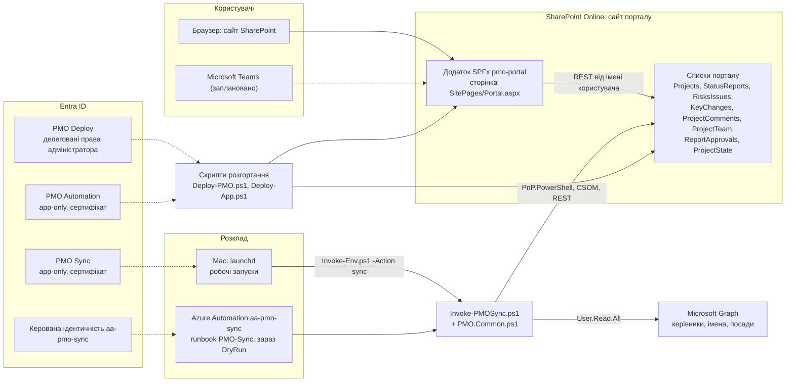

| Компонент | Де | Роль |
|---|---|---|
| Додаток SPFx `pmo-portal` | `spfx/`, пакет `pmo-portal.sppkg` 1.7.0.3 | інтерфейс за прототипом; читання й запис списків від імені користувача |
| Списки порталу | сайт `/sites/pmo-test` (прод — `/sites/ppm`) | усі дані, права на рівні проєктів і папок |
| Синхронізація | `scripts/Invoke-PMOSync.ps1` + `scripts/PMO.Common.ps1`; для Azure зібрано в `runbooks/Invoke-PMOSync.ps1` | погодження → звіт → картка, журнал, архів, еталон, права, учасники сайту, відгуки, нагадування |
| Розклад | `scripts/Set-AzureSchedule.ps1` (Azure Automation, робочі запуски з 04.10.2026); `scripts/Set-MacSchedule.ps1` (launchd, запасний варіант) | запуск синхронізації кожні 15 хвилин і щотижневий перерахунок прав |
| Розгортання | `scripts/Deploy-PMO.ps1`, `scripts/Deploy-App.ps1`, `scripts/Invoke-Env.ps1` | сайт, списки, поля, ролі, представлення, міграції, встановлення додатку, оглядовий документ у «Ресурси сайту» |
| Microsoft Graph | `Invoke-PnPGraphMethod` | ланцюжок керівників (`users/{id}/manager`), ім'я та посада; `sendMail` для нагадувань |
| Застосунки Entra ID | `scripts/Register-PMOApps.ps1` | PMO Deploy (вхід адміністратора), PMO Automation (розгортання без браузера), PMO Sync (синхронізація) |
| Керована ідентичність | `aa-pmo-sync` (системна) | вхід runbook без сертифіката й пароля |

## 3. Потоки

### 3.1. Створення проєкту (PMO)

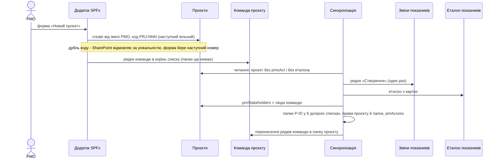

### 3.2. Статус-звіт → погодження PMO → картка

```mermaid
sequenceDiagram
    actor PM
    actor PMO
    participant App as Додаток SPFx
    participant R as Статус-звіти
    participant A as Погодження звітів
    participant S as Синхронізація
    participant P as Проєкти
    participant E as Еталон показників
    participant J as Зміни показників
    PM->>App: новий статус-звіт
    App->>App: SpRepo.fresh і guard - PM, не архів, немає іншого звіту на погодженні
    App->>R: createIn у папку проєкту, srApproval «На погодженні», srApplied = false
    PMO->>App: рішення - погодити, змінити оцінки з коментарем або повернути
    App->>App: fresh і guard - звіт ще не вирішено, автор досі PM
    App->>A: createIn рішення в папку проєкту
    Note over App: додаток одразу накладає рішення й погоджений звіт на картку (overlay)
    S->>A: розділ 0 - рішення від PMO, власника сайту або програми, проєкт збігається
    S->>R: srApproval, srApprovedBy, srApprovedAt, srApprovalNote, оцінки PMO
    S->>J: рядки «Погодження звіту»
    S->>R: розділ 1 - погоджені звіти по даті й ID
    alt звіт новіший за psLastApplied і автор - поточний PM
        S->>E: спочатку еталон
        S->>P: ключові показники, SystemUpdate
        S->>E: psLastApplied = дата і ID звіту
        S->>J: рядок «Статус-звіт» на кожне змінене поле журналу (статус, стан, тип, %, чотири дати; витрати — без рядка)
        opt статус «Завершено» або «Скасовано»
            S->>P: pmStatus «Архівний», pmArchivedAt = дата звіту
        end
    else старіший звіт, архів або автор уже не PM
        S->>J: рядок історії без зміни показників
    end
    S->>R: srApplied = true, копії типу й пріоритету
```

Найсвіжіший за датою звіт задає ще `pmRAG` (найгірша з трьох оцінок), `pmLastUpdate` (дата звіту) і `pmLastReport` (резюме). Звіт, старший за останній застосований (`psLastApplied`, порівняння дати й ID), показники не змінює.

### 3.3. Автоматичне повернення звітів

Розділ 0b синхронізації, до обробки рішень PMO (`Get-PendingReturns`, вектори `tests/cases/reports.json`; те саме правило — `logic/reportRules.ts`).

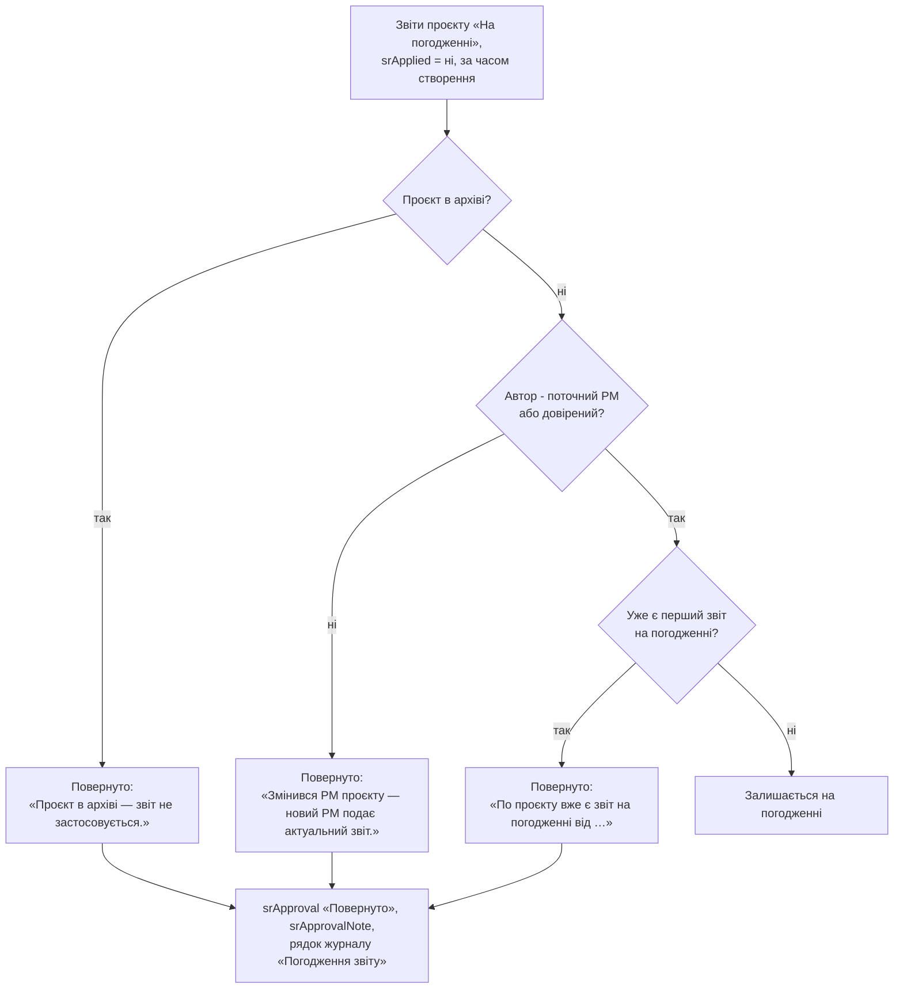

Окремо: у розділі 0 повторне рішення PMO щодо вже вирішеного звіту не застосовується (рядок «Повторне рішення PMO не застосовано»); перед розділом 1 «Погоджено» у звіті без рішення в «Погодження звітів» повертається в «На погодженні» (попередження, рядок журналу).

### 3.4. Правка картки → журнал

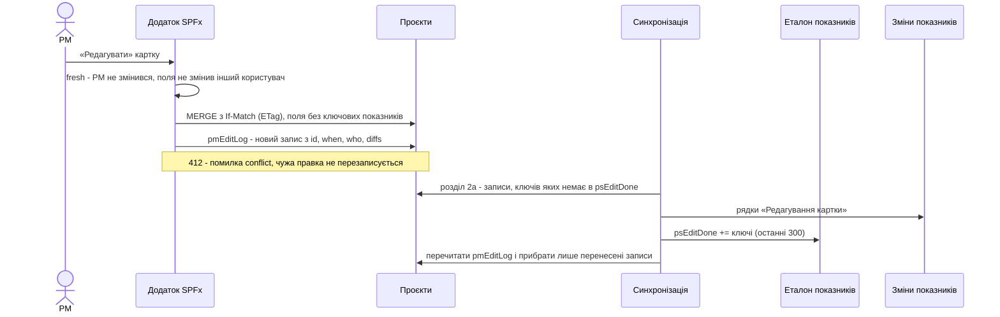

### 3.5. Відкат правки ключових полів в обхід звіту

Розділ 0a. Еталон (`Lists/ProjectState`) зберігає ключові поля після останньої законної зміни (`Get-StateKeys`). Хто змінив картку, визначається полем `Editor`: синхронізація пише картку `SystemUpdate`, тож «Змінив» залишається останньою людиною.

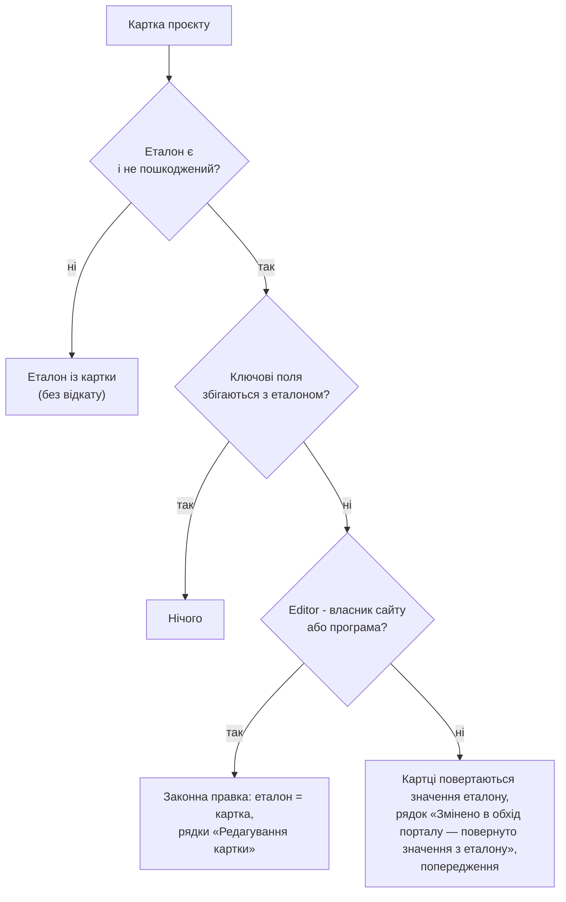

Програми розпізнаються за обліковим записом на сайті: `i:0i.t|…|app@sharepoint` («Програма SharePoint») або `i:0i.t|ms.sp.ext|…`. Людина без e-mail довіреною не вважається. Додаток показує ключові поля з еталону (`logic/state.ts`), тож підробку в картці не видно навіть до відкату.

### 3.6. Коментар

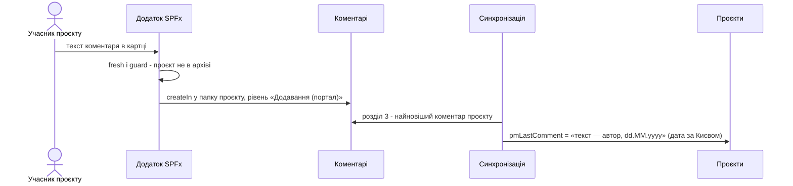

### 3.7. Відгуки (лише тест)

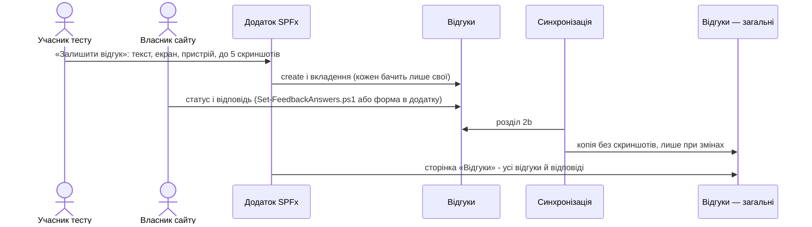

## 4. Синхронізація

`scripts/Invoke-PMOSync.ps1` працює від імені програми: сертифікат PMO Sync (`-CertificatePath` / `-Thumbprint`) або керована ідентичність Azure Automation (`-ManagedIdentity`). Повторний запуск нічого не задвоює.

### 4.1. Порядок розділів

Номери — як у коментарях скрипту; виконуються в такому порядку:

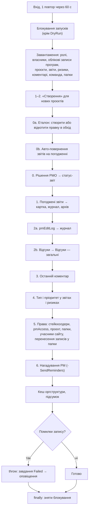

### 4.2. Блокування запусків

Паралельні запуски конфліктували при видачі прав («Конфлікт версій»), тому одночасно працює один запуск — з Mac, з Azure Automation чи вручну.

| Аспект | Реалізація |
|---|---|
| Де | службовий рядок у «Еталон показників»: `psProject = 0`, `Title` «Блокування синхронізації» |
| Захоплення | читання рядка з ETag і запис `psState` з `If-Match`; 412 — блокування взяв інший запуск, цей завершується |
| Вміст | `{"run","by","at","until"}`; `by` — ім'я машини або `azure-automation` |
| Строк | 45 хвилин (`$LOCK_MINUTES`); прострочене або пошкоджене блокування знімається з попередженням |
| Продовження | `Update-SyncLock` перед правами й перенесенням записів; якщо блокування перехопили — запуск зупиняється |
| Зняття | у `finally` навколо всього тіла, зокрема при помилці |
| DryRun | блокування не бере, лише повідомляє, що йде інший запуск |
| Токен | REST-запити блокування: під керованою ідентичністю — токен служби ідентичності (`IDENTITY_ENDPOINT`) для адреси тенанта, інакше `Get-PnPAccessToken` |
| Вектори | `Test-LockPlan` (free / busy / expired), `tests/cases/lock.json` |

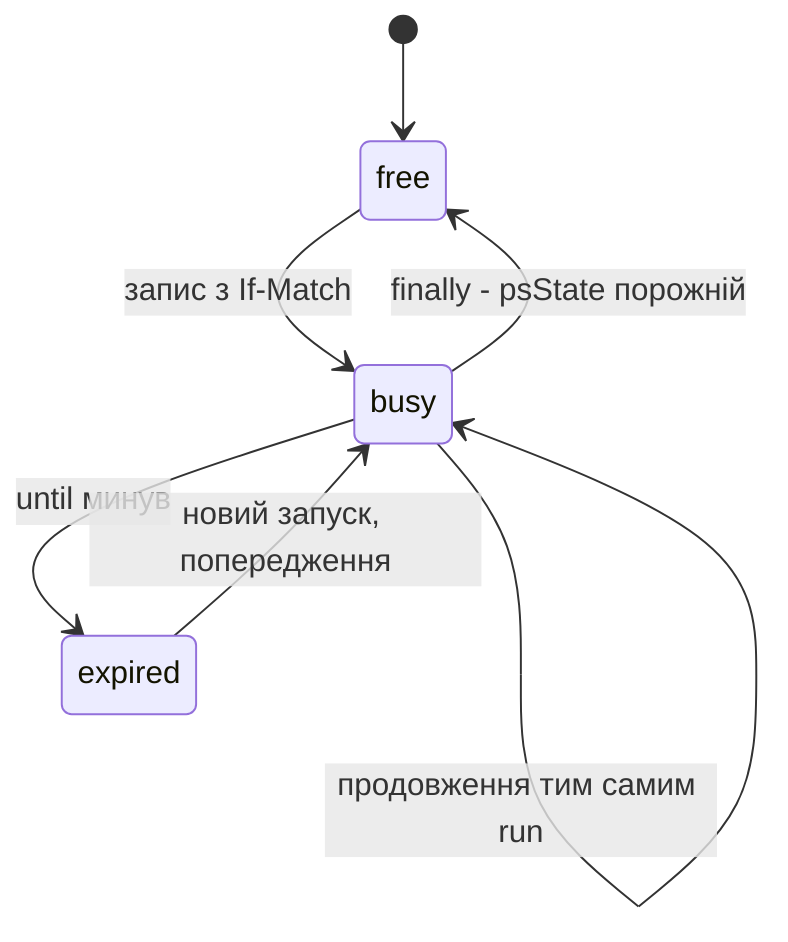

### 4.3. Помилки, час, кеш, режими

- **Помилки запису.** Збій видачі прав, створення папки, перенесення запису, запису стейкхолдерів, додавання учасника, відправки нагадування — «ПОМИЛКА» в журналі (`Fail`, лічильник `errors`); запуск доробляє решту й наприкінці кидає виняток. В Azure Automation завдання отримує «Failed», правило `pmo-sync-job-failed` надсилає лист. Попередження правил (не PM, правка в обхід) помилками не є. Якщо права не видано, `pmoAcl` не ставиться — наступний запуск повторює. HTTP 429 і збої CSOM — повтор (`Invoke-PnPQuery -RetryCount 10`; REST блокування — до 4 спроб).
- **Час за Києвом.** Дати для людей (`pmLastComment`, межа нагадувань) — `ConvertTo-Kyiv` (`Europe/Kyiv` → `Europe/Kiev` → `FLE Standard Time`), незалежно від поясу машини; пісочниця Azure — в UTC.
- **Журнал запуску.** На Mac — `Write-Host`; в Azure Automation (PowerShell 7.4) `Write-Host` у журнал завдання не потрапляє, тому рядки йдуть у потік Verbose (у runbook увімкнено докладний журнал), службовий Verbose PnP вимкнено.
- **Кеш оргструктури.** Керівники, імена й посади з Entra ID між запусками: на Mac — файл `~/.pmo-sync/managers-<env>.json` (`-ManagerCache`), в Azure Automation — зашифрована змінна `pmo-managers-<env>` (`-ManagerCacheVariable`). Перечитується не частіше ніж раз на `-ManagerCacheHours` (24). Збої Graph (крім «немає керівника») у кеш не пишуться. `-RebuildPermissions` кеш не читає, але оновлює.
- **`-DryRun`.** Лише читає й показує, що буде зроблено; блокування не бере.
- **`-RebuildPermissions`.** Перераховує права всіх проєктів і папок, зокрема архівних. Звичайний запуск архівний проєкт, права якого вже видано проєкту й усім папкам, пропускає (`Test-ArchiveFrozen`). За розкладом — щонеділі о 3:00.
- **`-SendReminders`.** Лист кожному PM зі списком активних проєктів без звіту довше `-ReminderDays` (7) через Graph `sendMail` від `-ReminderFrom`. За розкладом поки не запускається.

## 5. Модель доступу

Права обчислює `Get-Access` (вектори `tests/cases/acl.json`): перше входження людини перемагає, порядок — як у «Доступ до картки».

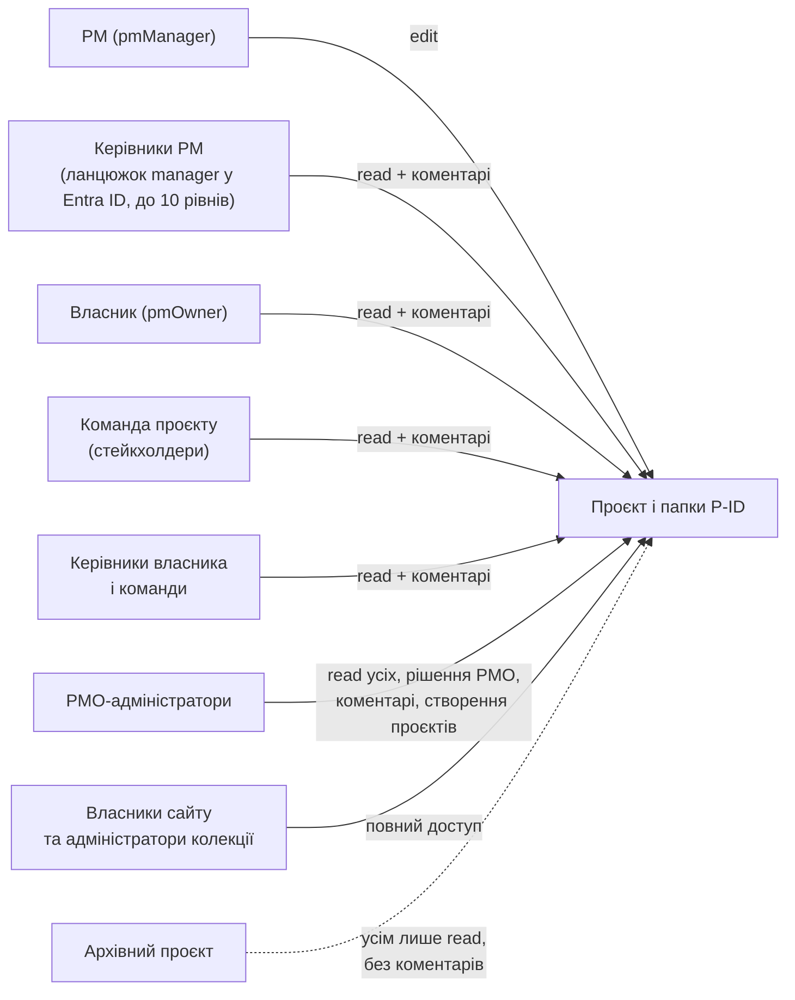

### 5.1. Модель прав v2

| Рівень | Що отримує |
|---|---|
| Сайт | учасники сайту — `Contributor` («Участь», не «Редагування»); `PMO-адміністратори` — читання; «Сторінки сайту», «Ресурси сайту», «Документи» — учасникам і PMO читання |
| Роль | «Додавання (портал)» — додавати й переглядати записи без зміни та видалення (створює `Deploy-PMO.ps1`) |
| Список «Проєкти» | учасники — читання, PMO — `Contributor` (створення проєктів) |
| Дочірні списки | учасники й PMO — читання на рівні списку (PMO на «Команда проєкту» — `Contributor`: команда нового проєкту) |
| Запис проєкту | PM — `Contributor`; решта людей доступу — читання; PMO — читання; власники — повний |
| Папка `P<ID>` | дивись таблицю нижче; записи успадковують права папки |
| Архів | усім читання (позначка `arch2:<хеш>`) |

| Дочірній список | PM | Інші люди проєкту | PMO |
|---|---|---|---|
| Статус-звіти | «Додавання (портал)» | читання | читання |
| Ризики та проблеми | `Contributor` | читання | читання |
| Команда проєкту | `Contributor` | читання | читання |
| Коментарі | «Додавання (портал)» | «Додавання (портал)» | «Додавання (портал)» |
| Погодження звітів | читання | читання | «Додавання (портал)» |
| Зміни показників | читання | читання | читання |

Власники сайту на кожному записі проєкту й папці — повний доступ. Функції — `Get-FolderRole`, `Get-GroupFolderRole`, `Get-AclMark` (вектори `tests/cases/folders.json`). Права видаються одним пакетним запитом CSOM на запис (скидання, PMO, власники, люди, позначка `pmoAcl`), лише коли змінився круг людей. Без ролі «Додавання (портал)» на сайті синхронізація працює за попередньою моделлю з попередженням.

**`pmAccess`** — JSON «Доступ до картки» (e-mail, ім'я, посада, рівень, роль), до 200 людей; формат — [DATA-MODEL.md](DATA-MODEL.md#pmaccess).

**Учасники сайту.** Кожного, хто отримав права хоча б на один проєкт, синхронізація додає в «Учасники сайту» (сторінка порталу доступна лише учасникам). Лише додає; прибирає власник сайту вручну.

**Лише через додаток** (розділ 8a `Deploy-PMO.ps1`): списки приховані з «Вміст сайту», меню сайту SharePoint вимкнено; додаток ховає шапку сайту, панель команд і ліву панель SharePoint усім, крім адміністраторів сайту (`manageWeb`). Обмеження SharePoint: оскільки додаток пише від імені користувача, список можна відкрити за прямою адресою й змінити те, на що є права; цю межу тримають права папок, еталон і правила синхронізації.

## 6. Додаток SPFx

SPFx 1.23.2, React 17.0.1, TypeScript ~5.8, збірка Heft 1.2.17 під Node 22. Одна веб-частина `PmoPortalWebPart` на сторінці `SitePages/Portal.aspx` (`SingleWebPartAppPage`); маніфест підтримує `SharePointWebPart`, `SharePointFullPage`, `TeamsPersonalApp`, `TeamsTab`.

### 6.1. Шари

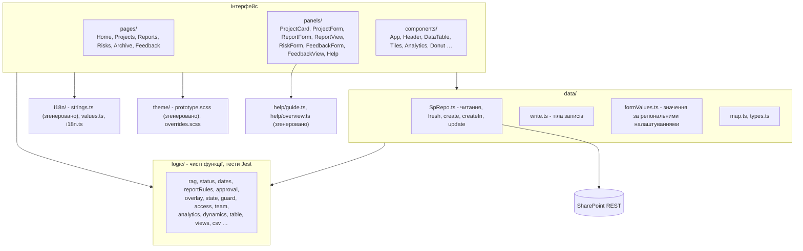

### 6.2. Читання й накладання

- `SpRepo.loadAll` паралельно читає списки з `$top=2000` і посторінково, відкидає папки (`withoutFolders`), журнал при завантаженні — лише переноси плану (`kcField eq 'pmPlanEnd'`); весь журнал проєкту — при відкритті картки.
- Ключові поля картки беруться з еталону (`applyState`), потім на картку накладаються ще не застосовані погоджені звіти (`applyPending`, `logic/overlay.ts`) — за тими самими правилами, що розділ 1 синхронізації; рішення PMO, ще не перенесене синхронізацією, теж враховується (`withApproval`). Тому зміни видно на екрані одразу, а в стандартних списках — після найближчої синхронізації.
- Оновлення: при поверненні на вкладку і раз на 5 хвилин — один легкий запит `SpRepo.stamp` (останні зміни списків порталу; журнал і еталон не враховуються); повне перечитування — лише якщо позначка змінилася. Новопризначений PM, якому ще не видано права, перевіряється раз на хвилину до 10 хвилин.

### 6.3. Захист запису

Перед кожним записом додаток читає свіжий стан проєкту (`SpRepo.fresh`: картка з еталоном і накладанням, ETag, права, звіти на погодженні, дата останнього погодженого, рішення щодо звіту) і перевіряє `guard` (`logic/guard.ts`, тести `spfx/test/guard.test.ts`).

| Дія | Відмова, якщо |
|---|---|
| будь-яка | проєкт в архіві |
| правка картки, звіт, ризик, команда | поточний користувач уже не PM (крім власника сайту) або права ще не видано |
| статус-звіт | уже є звіт на погодженні; дата раніше за останній погоджений |
| погодити | звіт уже вирішено або є рішення; автор — не поточний PM (повернути можна) |
| правка запису | запис змінив інший користувач: порівняння зі знімком і `If-Match` свіжої версії, 412 → «conflict» |

### 6.4. Запис у папку проєкту

`SpRepo.createIn` викликає `AddValidateUpdateItemUsingPath` з `FolderPath = Lists/<список>/P<ID>`: запис одразу отримує права папки, а в чужий проєкт або в корінь користувач записати не може. Значення передаються рядками, як у формі SharePoint (`data/formValues.ts`): дати й числа — за регіональними налаштуваннями сайту (`web/RegionalSettings`: роздільник дробу, порядок і роздільник дати), підстановки — ID, користувачі — `[{"Key":"i:0#.f|membership|<e-mail>"}]`. Перевірка форматів на тесті — `Invoke-Env -Action probe-formvalues`. Відповіді: 403 → `noRights`, 404 (папки ще немає) → `notReady`. Створення проєкту й відгуку, правка (`MERGE` з `If-Match`) і видалення рядка команди в кошик — звичайні REST-запити до елементів списку.

### 6.5. Мови, теми, згенеровані файли

- Мови uk / en / ru: за замовчуванням — мова профілю Microsoft 365, вибір зберігається в `localStorage` (`pmo-lang`). Тексти — `i18n/strings.ts`, значення вибору — `i18n/values.ts`.
- Теми світла й темна: за замовчуванням системна (`prefers-color-scheme`), вибір — `pmo-theme`.
- Згенеровані файли (вручну не правляться, результат комітиться):

| Файл | Джерело | Команда |
|---|---|---|
| `theme/prototype.scss`, `i18n/strings.ts` | словники `T`, `FLD` і CSS прототипу `prototype/pmo-prototype.html` + `EXTRA` у `tools/extract-prototype.mjs` | `scripts/spfx.sh npm run extract` |
| `help/guide.ts` («Довідка») | `docs/USER-GUIDE.{uk,en,ru}.md` | `scripts/spfx.sh npm run guide`; Jest звіряє розділи трьох мов |
| `help/overview.ts` («Детальний огляд системи» наприкінці «Довідки») | `docs/overview/overview.uk.html` | `scripts/spfx.sh npm run overview`: стилі документа обмежено контейнером `.ovw`, друковані правила A4 відкинуто; скриншоти й PDF — з «Ресурси сайту»/`pmo-overview` (завантажує `Deploy-App.ps1`, крок 5, лише змінені файли); Jest звіряє розділи й скриншоти з документом |

- Прототип `prototype/pmo-prototype.html` — еталон UX; якщо текст ТЗ і прототип розходяться, вирішує прототип (SPEC).
- Адреса `#вкладка/представлення/id/форма` відкриває потрібну вкладку, картку чи форму.

## 7. Розгортання й середовища

| Середовище | Сайт | Вхід | Правила |
|---|---|---|---|
| `test` | `/sites/pmo-test` | сертифікати PMO Automation (розгортання) і PMO Sync (синхронізація) | можна працювати самостійно |
| `prod` | `/sites/ppm` (ще не створено) | браузер, людина підтверджує | будь-яка дія, крім `sync-dryrun`, — лише з `-ConfirmProduction` після явного «так» у чаті |

**Єдина точка входу** — `scripts/Invoke-Env.ps1 -Env <test|prod> -Action <дія>`: параметри з `config/environments.json` (не в git), паролі сертифікатів — зі змінної середовища або зі «Связки ключей» macOS. Дії: `deploy`, `app`, `sync`, `sync-dryrun`, `reminders`, `rebuild-permissions`, `seed`, `refresh`, `renumber`, `renumber-dryrun`, `feedback`, `feedback-answers`, `whois`, `acl-export`, `probe-formvalues`, `perm-check`, `aa-whoami`.

**Порядок розгортання:** `-Action deploy` (сайт, ролі, списки, поля, міграції, права списків, представлення, закриття сайту, прибирання) → `-Action app` (збірка, каталог додатків сайту, пакет, сторінка `Portal` — головна, оглядовий документ; поки лише для `test`) → `-Action sync-dryrun` → `-Action sync`. Під час зміни, що зачіпає синхронізацію, розклад знімають на час викладки й ставлять знову (DEPLOYMENT).

### 7.1. Azure Automation

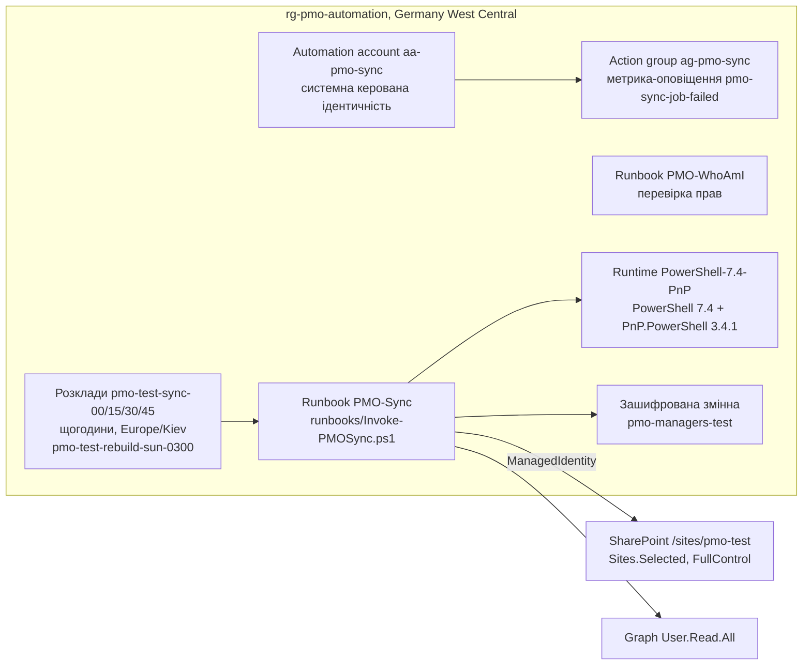

| Крок | Скрипт | Що робить |
|---|---|---|
| Ресурси | `scripts/New-PMOAutomation.ps1` | група ресурсів, обліковий запис з керованою ідентичністю (ролей Azure їй не видається), runtime PowerShell 7.4 з PnP.PowerShell 3.4.1 з PowerShell Gallery, зашифрована змінна кешу |
| Права | `scripts/Grant-PMOAutomation.ps1` (виконує адміністратор тенанта) | ролі програми Sites.Selected і Graph User.Read.All сервісному суб'єкту ідентичності; FullControl лише на сайт порталу (вхід програмою PMO Deploy) |
| Збірка | `scripts/Build-Runbook.ps1` | `Invoke-PMOSync.ps1` + вміст `PMO.Common.ps1` замість рядка підключення → `runbooks/Invoke-PMOSync.ps1`; перший рядок — відбиток вихідників `sha256:<12 символів>`; без `$PSScriptRoot` |
| Публікація | `scripts/Publish-Runbook.ps1` | звіряє зібраний файл з вихідниками, створює чи оновлює runbook у runtime, вмикає докладний журнал, публікує і звіряє опублікований текст |
| Розклад | `scripts/Set-AzureSchedule.ps1` | Azure запускає розклад не частіше разу на годину, тож «кожні 15 хвилин» — 4 щогодинні розклади зі зсувом :00 / :15 / :30 / :45; неділя 3:00 — `-RebuildPermissions`; без `-Live` — `-DryRun`; `-Disable` — вимкнути (відкат на Mac); `-AlertEmail` — група дій і правило за метрикою `TotalJob` зі `Status = Failed` |

Поточний стан (04.10.2026): робочі запуски тестового сайту — в Azure Automation (`Set-AzureSchedule.ps1 -Live`); розклад на Mac знято, лишається запасним варіантом (відкат: `-Disable` в Azure, `Set-MacSchedule.ps1 -AllDay`). Пробний паралельний період 01–04.10: 299 успішних запусків, медіана 29 с. Перемикання — після доби паралельної роботи без помилок: `Set-MacSchedule.ps1 -Remove`, `Set-AzureSchedule.ps1 -Live` (план — `docs/superpowers/plans/2026-10-01-azure-automation.md`). Спільне блокування в SharePoint не дає Mac і Azure писати одночасно.

### 7.2. Mac (launchd)

`scripts/Set-MacSchedule.ps1 -Env test` ставить два завдання користувача `~/Library/LaunchAgents`: `ua.pmo.sync.<env>` (пн–пт 8:00–20:00 кожні 15 хвилин, щодня 6:00 і 22:00; з `-AllDay` — цілодобово) і `ua.pmo.rebuild.<env>` (неділя 3:00, `rebuild-permissions`). Завдання запускають `scripts/` останнього коміту (копія `git archive HEAD` у `~/Library/Application Support/PMO-sync/<env>`), `config/` і сертифікат — з репозиторію через `-RepoRoot`. Журнал — `~/Library/Logs/pmo-sync-<env>.log`. Працює, поки Mac увімкнено й користувач увійшов; після переходу на Azure залишається запасним варіантом.

## 8. Якість, тести, процес змін

| Перевірка | Що перевіряє |
|---|---|
| `tests/Test-Scripts.ps1` (без доступу до SharePoint) | синтаксис PowerShell; імена змінних, що різняться лише регістром; «висячі» `else`; валідність JSON; відсутність колишнього оформлення SharePoint; права й «Доступ до картки» (`acl.json`); ролі папок, заморожування архіву, перенесення записів (`folders.json`); CSOM лише з `-RetryCount`; блокування й час за Києвом (`lock.json`); runbook: синтаксис, без `$PSScriptRoot`, збігається зі збіркою з поточних вихідників; еталон (`state.json`); авто-повернення й застосування звітів (`reports.json`); журнал правок (`editlog.json`, `card-edit.json`); ролі фокус-групи; формула стану (`rag.json`); погодження (`approval.json`); дати (`dates.json`); синтаксис JS прототипу (`node --check`) |
| Jest (`scripts/spfx.sh npm run test:unit`) | 29 тестових файлів у `spfx/test/`: правила `logic/`, мапінг даних, тіла записів, значення форм, guard, накладання, папки, i18n і CSS, розділи «Довідки» й огляду; спільні вектори `approval`, `card-edit`, `dates`, `rag`, `reports`, `state`, `report-form` |
| Прототип у jsdom (`spfx/test/prototypeForm.test.ts`) | ті самі вектори форми статус-звіту (`tests/cases/report-form.json`) проганяються на справжньому `prototype/pmo-prototype.html` через кнопки інтерфейсу (кожен тест — на свіжому прототипі): розбіжність прототипу й додатку валить тест |
| Збірка | `scripts/spfx.sh npm run build` (`heft test --clean --production` і `heft package-solution`) |
| CI | `.github/workflows/validate.yml`: `Test-Scripts.ps1`, `npm ci`, `npm run test:unit`, `npm run build` на кожен push і pull request |
| Діагностика на сайті (лише читання) | `-Action whois`, `acl-export`, `perm-check`, `aa-whoami` |

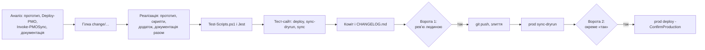

## 9. Безпека

| Аспект | Рішення |
|---|---|
| Синхронізація (PMO Sync) | SharePoint Sites.Selected + FullControl лише на сайт порталу (за замовчуванням; `-AllSites` дає Sites.FullControl.All — не використовується); Graph User.Read.All; Mail.Send — для нагадувань, обмежити одним ящиком через `New-ApplicationAccessPolicy` (DEPLOYMENT) або не видавати (`-NoMail`) |
| Керована ідентичність `aa-pmo-sync` | Sites.Selected (FullControl лише на `/sites/pmo-test`) і User.Read.All; без сертифіката й пароля; ролей Azure не має; Mail.Send — лише коли ввімкнуться нагадування |
| PMO Deploy | делеговані права адміністратора, вхід людини в браузері; через нього видається доступ до сайту для Sites.Selected |
| PMO Automation | app-only за сертифікатом із Sites.FullControl.All — для розгортання без браузера; за коментарем у `Register-PMOApps.ps1` видається лише для тестового тенанта або викладка на прод тримається під підтвердженням людини |
| Секрети | `certs/`, `*.pfx`, `.env`, `config/environments.json`, `config/focus-group.json`, `config/feedback-answers.json` — поза git; паролі сертифікатів — змінні середовища або «Связка ключей» macOS; кеш оргструктури в Azure — зашифрована змінна |
| Додаток | працює під правами користувача, нічого не підвищує; ключові дані й права у штатній роботі пише лише синхронізація (виняток — скрипти міграцій і тестових даних, які оновлюють еталон через `Sync-ProjectStateFromCard`, див. DATA-MODEL); перед записом — свіжа перевірка й `If-Match` |
| Дані | нічого не видаляється без міграції; списки й сторінки при прибиранні — у кошик сайту (відновлення 93 дні) |
| Прод | будь-яка зміна — лише після явного «так» людини; `Invoke-Env.ps1` вимагає `-ConfirmProduction` |
