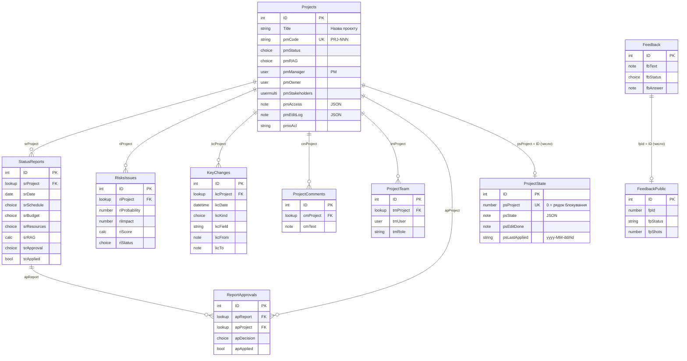

# Модель даних

Усі дані порталу «Портфель проєктів» зберігаються у списках SharePoint одного сайту (`/sites/pmo-test` — тест, `/sites/ppm` — прод). Інших баз немає.

Джерело істини для списків і полів — `scripts/Deploy-PMO.ps1`: списки створює функція `Ensure-List`, поля — функція `F` (поле додається, лише якщо його ще немає; наявні поля `F` не змінює). Цей документ описує стан після останнього розгортання. Архітектура й потоки — [ARCHITECTURE.md](ARCHITECTURE.md).

## Зміст

- [Діаграма зв'язків](#діаграма-звязків)
- [Загальні правила](#загальні-правила)
- [Проєкти](#проєкти-listsprojects)
- [Статус-звіти](#статус-звіти-listsstatusreports)
- [Ризики та проблеми](#ризики-та-проблеми-listsrisksissues)
- [Зміни показників](#зміни-показників-listskeychanges)
- [Коментарі](#коментарі-listsprojectcomments)
- [Погодження звітів](#погодження-звітів-listsreportapprovals)
- [Команда проєкту](#команда-проєкту-listsprojectteam)
- [Еталон показників](#еталон-показників-listsprojectstate)
- [Відгуки](#відгуки-listsfeedback-лише-тест)
- [Відгуки — загальні](#відгуки--загальні-listsfeedbackpublic-лише-тест)
- [Перевірка форматів](#перевірка-форматів-listsportalprobe-службовий-лише-тест)
- [Формати JSON службових полів](#формати-json-службових-полів)
- [Міграції та прибирання попередньої версії](#міграції-та-прибирання-попередньої-версії)
- [Звірка покриття](#звірка-покриття)

## Діаграма зв'язків

Підстановки на проєкт (`srProject`, `riProject`, `kcProject`, `cmProject`, `tmProject`, `apProject`) мають `Required='TRUE'`, `Indexed='TRUE'` і `RelationshipDeleteBehavior='Restrict'`: проєкт із пов'язаними записами видалити не можна. `apReport` — така сама підстановка на статус-звіт (показує ID). `psProject` і `fpId` — не підстановки, а числа з ID запису.



## Загальні правила

### Списки

| URL | Назва (uk) | en / ru | Де |
|---|---|---|---|
| `Lists/Projects` | Проєкти | Projects / Проекты | усі сайти |
| `Lists/StatusReports` | Статус-звіти | Status reports / Статус-отчёты | усі сайти |
| `Lists/RisksIssues` | Ризики та проблеми | Risks and issues / Риски и проблемы | усі сайти |
| `Lists/KeyChanges` | Зміни показників | Indicator changes / Изменения показателей | усі сайти |
| `Lists/ProjectComments` | Коментарі | Comments / Комментарии | усі сайти |
| `Lists/ReportApprovals` | Погодження звітів | Report approvals / Согласование отчётов | усі сайти |
| `Lists/ProjectAssignments` | Призначення | Assignments / Назначения | усі сайти |
| `Lists/NotifyState` | Прочитане | Read marks / Прочитанное | усі сайти |
| `Lists/ProjectTeam` | Команда проєкту | Project team / Команда проекта | усі сайти |
| `Lists/ProjectState` | Еталон показників | Indicator baseline / Эталон показателей | усі сайти |
| `Lists/Feedback` | Відгуки | Feedback / Отзывы | лише тест (`Deploy-PMO.ps1 -Feedback`) |
| `Lists/FeedbackPublic` | Відгуки — загальні | Feedback — shared / Отзывы — общие | лише тест (`-Feedback`) |
| `Lists/PortalProbe` | Перевірка форматів | — | лише тест; створює не `Deploy-PMO.ps1`, а `Test-FormValues.ps1` і runbook `PMO-WhoAmI` |

Для кожного списку `Ensure-List` під час створення списку вмикає версії (до 100 основних), вимикає вбудовані коментарі SharePoint (`DisableCommenting`) і задає назви трьома мовами. Розділ 8a `Deploy-PMO.ps1` приховує всі списки порталу (`Hidden`) — їх немає у «Вміст сайту» й меню; додаток і власники сайту відкривають їх за адресою.

### Хто пише

| Записувач | Як | Що |
|---|---|---|
| Додаток SPFx | REST від імені користувача, лише в межах його прав | новий проєкт (PMO), правка картки без ключових показників, статус-звіти, ризики, коментарі, команда, рішення PMO, відгуки |
| Синхронізація `Invoke-PMOSync.ps1` | app-only (сертифікат PMO Sync або керована ідентичність Azure Automation), повний доступ лише до сайту порталу | ключові показники картки, журнал, права, `pmAccess`, `pmoAcl`, еталон, погодження у звітах, копії типу й пріоритету, `pmLastComment`, `pmStakeholders`, «Відгуки — загальні» |
| Службові скрипти | app-only (PMO Automation) або вхід адміністратора | `Deploy-PMO.ps1` (схема, міграції), `Seed-TestData.ps1`, `Refresh-TestData.ps1`, `Renumber-Projects.ps1`, `Set-FeedbackAnswers.ps1` |

Скрипт, що законно змінює ключові поля картки, після запису викликає `Sync-ProjectStateFromCard` (`scripts/PMO.Common.ps1`), інакше синхронізація відкотить зміну до еталону.

### Папки проєктів

Шість дочірніх списків — `StatusReports`, `RisksIssues`, `ProjectComments`, `KeyChanges`, `ProjectTeam`, `ReportApprovals` — розкладені по папках `P<ID проєкту>` (наприклад, `P42`). Папки створює синхронізація (розділ 5) і видає права саме папці; записи всередині успадковують права папки.

- Додаток створює записи одразу в папці свого проєкту (`SpRepo.createIn`). У корінь пишуть лише PMO (команда нового проєкту, коли папок ще немає) і службові скрипти; синхронізація переносить такі записи в папку (ID, автор, дати, зв'язки й версії зберігаються) і скидає їхні особисті права.
- Запис у папці іншого проєкту (поле проєкту підмінено) не враховується і не переноситься (`Test-RowPlacement`, вектори `tests/cases/folders.json`).
- Будь-яке читання дочірнього списку відкидає самі папки: у синхронізації — `Get-ListRows`, у додатку — `withoutFolders` (`FileSystemObjectType`), в інших скриптах — `FileSystemObjectType -ne "Folder"`.
- Усі представлення дочірніх списків мають `Scope = Recursive`: записи всіх папок плоским списком.
- Фільтри REST по великих списках — лише за індексованими полями (поріг 5 000 записів).

### Дати «лише дата»

| Хто пише | Що зберігається |
|---|---|
| Синхронізація (`ToSpDate`), додаток через REST (`spDate` у `data/write.ts`) | полудень UTC: `yyyy-MM-ddT12:00:00Z` |
| Форма SharePoint і запис у папку через `AddValidateUpdateItemUsingPath` (рядок за регіональними налаштуваннями сайту) | північ за поясом сайту, переведена в UTC |

Читання — `DateOnly` (`scripts/PMO.Common.ps1`): якщо час UTC рівно 12:00 — береться дата UTC, інакше до значення додаються 12 годин. Обидва варіанти дають правильну календарну дату. Вектори — `tests/cases/dates.json` (їх перевіряють і `tests/Test-Scripts.ps1`, і Jest).

### Значення вибору

Значення полів вибору зберігаються українською і однакові в `Deploy-PMO.ps1`, CAML-представленнях, `Invoke-PMOSync.ps1`, прототипі та додатку. На екрані додаток перекладає їх словником `spfx/src/webparts/pmoPortal/i18n/values.ts` (у прототипі — `VAL`). Назви представлень SharePoint не перекладає.

### Ролі (рівні дозволів)

`Deploy-PMO.ps1` шукає стандартні рівні за типом (`RoleTypeKind`), бо їхні назви локалізовані: `Administrator` (повний доступ), `Contributor` («Участь»), `Reader` (читання). Власний рівень **«Додавання (портал)»**: `ViewListItems, AddListItems, OpenItems, ViewVersions, ViewFormPages, ViewPages, Open, BrowseUserInfo, UseRemoteAPIs, UseClientIntegration` — додавати й переглядати записи без зміни та видалення.

### Позначення в таблицях полів

- **Тип** — тип поля SharePoint з атрибута `Type` у виклику `F`; «Дата» — `DateTime` з `Format='DateOnly'`, «Дата й час» — `Format='DateTime'`.
- **Обов.** — `Required='TRUE'`.
- **Інд.** — індекс поля (`Indexed='TRUE'` у визначенні або `Set-PnPField … Indexed` у розділах 2, 5, 7).
- **Пише** — хто встановлює значення в звичайній роботі.

---

## Проєкти (`Lists/Projects`)

**Призначення:** картка проєкту. Одна запис — один проєкт.

**Пише:** PMO створює запис у додатку (статус, тип, дати задаються при створенні); PM (і власник сайту) правлять у додатку назву, пріоритет, напрям, PM, власника, бюджет, опис, посилання; ключові показники — лише синхронізація з погодженого статус-звіту.

**Папки:** немає (сам список). **Права:** на рівні списку — учасники сайту читання, `PMO-адміністратори` — `Contributor` (створення проєктів). Кожен запис має унікальні права, які видає синхронізація: PM — `Contributor`, решта людей із «Доступ до картки» — читання, PMO — читання, власники сайту — повний доступ; архівний проєкт — читання всім.

| Поле | Назва (uk) | Тип | Обов. | Значення / формула | Інд. | Пише | Зміст |
|---|---|---|---|---|---|---|---|
| `Title` | Назва проєкту | Text | так | — | так | додаток | назва проєкту |
| `pmCode` | Код проєкту | Text (30) | — | `PRJ-###`; `EnforceUniqueValues`, якщо дублів немає | так | додаток (автоматично), `Renumber-Projects.ps1` | номер проєкту: `PRJ-` + (максимальний + 1); входить в еталон |
| `pmLoop` | Посилання на картку в Loop | URL | — | `Format='Hyperlink'` | — | — (застаріле) | колишнє посилання; міграція `links` переносить у `pmLinks`, додаток читає як запасне |
| `pmType` | Тип проєкту | Choice | так | Стратегічний, Звичайний (за замовч. Звичайний) | — | додаток при створенні, далі синхронізація | ключовий показник |
| `pmManager` | PM | User | так | лише люди | — | додаток | керівник проєкту; єдиний, хто править проєкт |
| `pmOwner` | Власник | User | — | лише люди | — | додаток | замовник проєкту |
| `pmStakeholders` | Стейкхолдери | UserMulti | — | лише люди, `Mult='TRUE'` | — | синхронізація | повторює людей «Команда проєкту» (після міграції `team`) |
| `pmDepartment` | Напрям | Choice | — | ІТ, HR та кадрове адміністрування, Розрахунок зарплати, Продажі, Фінанси, Операції, Юридичний | — | додаток | напрям бізнесу |
| `pmStatus` | Статус проєкту | Choice | так | Ініціація, Планування, Реалізація, Призупинено, Завершено, Скасовано (за замовч. Ініціація) | — | додаток при створенні, далі синхронізація | ключовий показник; «Завершено» / «Скасовано» — архів |
| `pmPriority` | Пріоритет | Choice | — | 1 — Високий, 2 — Середній, 3 — Низький (за замовч. 2 — Середній) | — | додаток | пріоритет |
| `pmRAG` | Загальний стан | Choice | — | Зелений, Жовтий, Червоний | — | синхронізація | стан найсвіжішого погодженого звіту |
| `pmProgress` | % виконання | Number | — | 0–100, 0 знаків, за замовч. 0 | — | синхронізація (при створенні — 0) | ключовий показник |
| `pmStart` | Дата старту | DateTime | — | Дата | — | додаток при створенні, далі синхронізація | ключовий показник |
| `pmGoLive` | Дата запуску (продакшн) | DateTime | — | Дата | — | так само | ключовий показник |
| `pmPlanEnd` | Дата завершення (план) | DateTime | — | Дата | — | так само | ключовий показник; зсуви видно в журналі (`kcField = pmPlanEnd`) |
| `pmForecastEnd` | Прогноз завершення | DateTime | — | Дата | — | синхронізація | ключовий показник |
| `pmActualEnd` | Дата завершення (факт) | DateTime | — | Дата | — | синхронізація | ключовий показник; зі звіту «Завершено» / «Скасовано» (#54); у проєктів, архівованих раніше, — порожньо |
| `pmArchivedAt` | Дата завершення / скасування | DateTime | — | Дата | — | синхронізація | дата звіту зі статусом «Завершено» / «Скасовано» |
| `pmBudget` | Бюджет (план) | Currency | — | `LCID='1058'`, 0 знаків | — | додаток | плановий бюджет; у додатку — у доларах США (SPEC 4.1) |
| `pmActualCost` | Витрати (факт) | Currency | — | `LCID='1058'`, 0 знаків | — | синхронізація | ключовий показник (з `srActualCost`) |
| `pmLastUpdate` | Останній статус-звіт | DateTime | — | Дата | — | синхронізація | дата найсвіжішого застосованого звіту; основа «свіжості» |
| `pmLastReport` | Останній апдейт | Note (3 рядки) | — | — | — | синхронізація | резюме (`Title`) найсвіжішого звіту |
| `pmLastComment` | Останній коментар | Note (3 рядки) | — | `текст — автор, dd.MM.yyyy` (дата за Києвом) | — | синхронізація | останній коментар із «Коментарі» |
| `pmDescription` | Мета та опис | Note (6 рядків) | — | — | — | додаток | опис |
| `pmBudgetUse` | Освоєння бюджету, % | Calculated (Number) | — | `=IF([pmBudget]=0,0,[pmActualCost]/[pmBudget]*100)` | — | SharePoint | факт / план, % |
| `pmoAcl` | Службове: права | Text (64), прихов. | — | `v2:<хеш>` / `arch2:<хеш>` (попередня модель: `<хеш>` / `arch:<хеш>`) | — | синхронізація | позначка виданих прав, див. [формати](#pmoacl) |
| `pmAccess` | Службове: доступ | Note, прихов. | — | JSON | — | синхронізація | «Доступ до картки», див. [формати](#pmaccess) |
| `pmLinks` | Посилання | Note, прихов. | — | JSON `[{t,u}]` | — | додаток | блок «Посилання» картки, див. [формати](#pmlinks) |
| `pmMigrated` | Службове: міграція | Text (100), прихов. | — | `team`, `links` через кому | — | `Deploy-PMO.ps1` | одноразові міграції раунду 2 вже виконані |
| `pmEditLog` | Службове: правки картки | Note, прихов. | — | JSON | — | додаток; синхронізація прибирає перенесене | «було / стало» правок картки до перенесення в журнал, див. [формати](#pmeditlog) |

Стандартні поля, які використовують додаток і синхронізація: `Author`, `Created` (рядок «Створення» в журналі), `Editor` (хто змінив картку — для звірки з еталоном), `EffectiveBasePermissions` (права поточного користувача).

**Форми SharePoint** (розділ 7): `pmStatus`, `pmType`, `pmProgress`, `pmStart`, `pmGoLive`, `pmPlanEnd` — лише у формі створення; `pmRAG`, `pmForecastEnd`, `pmActualEnd`, `pmActualCost`, `pmArchivedAt`, `pmLastUpdate`, `pmLastReport`, `pmLastComment` — приховані в обох формах.

**Представлення:** «Усі проєкти» (базове `AllItems.aspx`, за замовчуванням, без архіву), «Стратегічні», «Проблемні», «Мої проєкти», «Немає свіжого звіту», «Архів». Порядок колонок: `pmType`, `pmPriority`, назва, решта.

**Ключові показники** (міняються лише погодженим статус-звітом, входять в еталон): `pmStatus`, `pmRAG`, `pmType`, `pmProgress`, `pmStart`, `pmGoLive`, `pmPlanEnd`, `pmForecastEnd`, `pmActualCost`, `pmArchivedAt`, `pmLastUpdate`, `pmLastReport`, `pmActualEnd`, а також `pmCode`; в еталоні також `pmManager` і `pmOwner` (e-mail; змінює лише «Призначення» — правка в обхід повертається). Еталон, записаний до появи ключа, не дає розбіжності з порожнім полем картки.

---

## Статус-звіти (`Lists/StatusReports`)

**Призначення:** регулярний звіт PM — єдиний спосіб змінити ключові показники проєкту.

**Пише:** PM у додатку створює звіт одразу в папці проєкту (`srApplied = ні`, `srApproval` за замовчуванням «На погодженні»); ключові показники заповнюються лише змінені (крім `srProgress` — завжди). Створений звіт ніхто, крім синхронізації, не править. Синхронізація пише погодження (з «Погодження звітів»), авто-повернення, `srApplied`, копії типу й пріоритету.

**Папки:** `P<ID>`. **Права:** список — учасники сайту й PMO читання; папка — PM «Додавання (портал)», інші люди проєкту та PMO — читання, власники — повний доступ; архів — читання всім.

| Поле | Назва (uk) | Тип | Обов. | Значення / формула | Інд. | Пише | Зміст |
|---|---|---|---|---|---|---|---|
| `Title` | Резюме одним рядком | Text | так | — | — | додаток | резюме; потрапляє в `pmLastReport` і причину в журналі |
| `srProject` | Проєкт | Lookup → Projects (`Title`) | так | Restrict | так | додаток | проєкт звіту |
| `srProjectType` | Стратегічний | Choice | — | Стратегічний, Звичайний | — | синхронізація | копія `pmType` (прихована у формах) |
| `srProjectPriority` | Пріоритет | Choice | — | 1 — Високий, 2 — Середній, 3 — Низький | — | синхронізація | копія `pmPriority` (прихована у формах) |
| `srDate` | Дата звіту | DateTime | так | Дата, за замовч. `[today]` | — | додаток | дата звіту; визначає «найсвіжіший» |
| `srPeriod` | Період | Choice | — | Тиждень, 2 тижні, Місяць, Квартал (за замовч. 2 тижні) | — | додаток | звітний період |
| `srSchedule` | Терміни | Choice | так | Зелений, Жовтий, Червоний | — | додаток; PMO може змінити рішенням | оцінка термінів |
| `srBudget` | Бюджет | Choice | так | Зелений, Жовтий, Червоний | — | так само | оцінка бюджету |
| `srResources` | Ресурси | Choice | так | Зелений, Жовтий, Червоний | — | так само | оцінка ресурсів |
| `srRAG` | Загальний стан | Calculated (Text) | — | `=IF(OR([srSchedule]="Червоний",[srBudget]="Червоний",[srResources]="Червоний"),"Червоний",IF(OR([srSchedule]="Жовтий",[srBudget]="Жовтий",[srResources]="Жовтий"),"Жовтий","Зелений"))` | — | SharePoint | найгірша з трьох оцінок (вектори `tests/cases/rag.json`) |
| `srStatus` | Статус проєкту | Choice | — | Ініціація, Планування, Реалізація, Призупинено, Скасовано, Завершено | — | додаток | новий статус; «Завершено» / «Скасовано» → проєкт «Архівний» |
| `srType` | Тип проєкту | Choice | — | Стратегічний, Звичайний | — | додаток | новий тип |
| `srProgress` | % виконання | Number | — | 0–100, 0 знаків | — | додаток | % у кожному звіті |
| `srStart` | Дата старту | DateTime | — | Дата | — | додаток | нова дата, якщо змінена |
| `srGoLive` | Дата запуску (продакшн) | DateTime | — | Дата | — | додаток | так само |
| `srPlanEnd` | Дата завершення (план) | DateTime | — | Дата | — | додаток | так само |
| `srForecastEnd` | Прогноз завершення | DateTime | — | Дата | — | додаток | так само |
| `srBasedOn` | На основі звіту | Number | — | номер поверненого звіту | — | додаток | «Новий звіт на основі повернутого» (#46); синхронізація враховує лише повернутий звіт цього проєкту |
| `srActualEnd` | Дата завершення (факт) | DateTime | — | Дата | — | додаток | обов'язкова при «Завершено» / «Скасовано»: не раніше старту, не пізніше дати звіту (#54) |
| `srActualCost` | Витрати на дату | Currency | — | `LCID='1058'`, 0 знаків | — | додаток | фактичні витрати |
| `srKeyReason` | Причина зміни показників | Note (3) | — | обов'язкова в додатку при зміні статусу, типу чи дат | — | додаток | потрапляє в журнал (`kcReason`) |
| `srDone` | Зроблено за період | Note (5) | — | — | — | додаток | |
| `srNext` | План на наступний період | Note (5) | — | — | — | додаток | |
| `srIssues` | Проблеми та ризики | Note (5) | — | — | — | додаток | |
| `srDecision` | Потрібне рішення керівництва | Boolean | — | за замовч. 0 | — | додаток | ознака запиту на рішення |
| `srDecisionText` | Яке рішення потрібне | Note (3) | — | — | — | додаток | текст запиту |
| `srApplied` | Службове: застосовано | Boolean, прихов. | — | за замовч. 0 | — | додаток пише `false`, синхронізація — `true` | звіт оброблено (перенесено або позначено) |
| `pmoAcl` | Службове: права | Text (64), прихов. | — | — | — | синхронізація | у записах — позначка особистих прав попередньої моделі (очищається при перенесенні в папку); у папці — позначка прав папки |
| `srApproval` | Погодження | Choice | — | На погодженні, Погоджено, Повернуто (за замовч. На погодженні) | — | синхронізація | стан погодження PMO (приховане у формах) |
| `srApprovedBy` | Погодив | User | — | — | — | синхронізація | автор рішення PMO |
| `srApprovedAt` | Дата погодження | DateTime | — | Дата й час | — | синхронізація | час рішення або авто-повернення |
| `srApprovalNote` | Коментар PMO | Note (3) | — | — | — | синхронізація | коментар рішення або текст авто-повернення |

**Підказки під полями** (`Desc`): у `srType`, `srProgress`, `srStart`, `srGoLive`, `srPlanEnd`, `srForecastEnd`, `srActualCost` — «Залиште порожнім, якщо не змінюється.»; також `srStatus`, `srActualEnd`, `srKeyReason`, `srDecisionText`, `srSchedule`.

**Представлення:** «Усі звіти» (базове), «Потребують рішення» (`srDecision = 1`).

---

## Ризики та проблеми (`Lists/RisksIssues`)

**Призначення:** ризики й проблеми проєкту з оцінкою «ймовірність × вплив».

**Пише:** PM у додатку (створення в папці проєкту, правка з `If-Match`). Синхронізація — копії типу й пріоритету.

**Папки:** `P<ID>`. **Права:** список — учасники сайту й PMO читання; папка — PM `Contributor`, інші люди проєкту та PMO — читання; архів — читання всім.

| Поле | Назва (uk) | Тип | Обов. | Значення / формула | Інд. | Пише | Зміст |
|---|---|---|---|---|---|---|---|
| `Title` | Ризик / проблема (у формі — «Опис») | Text | так | — | — | додаток | опис |
| `riProject` | Проєкт | Lookup → Projects | так | Restrict | так | додаток | |
| `riProjectType` | Стратегічний | Choice | — | Стратегічний, Звичайний | — | синхронізація | копія `pmType` |
| `riProjectPriority` | Пріоритет | Choice | — | 1 — Високий, 2 — Середній, 3 — Низький | — | синхронізація | копія `pmPriority` |
| `riType` | Тип | Choice | — | Ризик, Проблема (за замовч. Ризик) | — | додаток | |
| `riProbability` | Ймовірність (1–5) | Number | — | 1–5, за замовч. 3 | — | додаток | шкала — в описі поля |
| `riImpact` | Вплив (1–5) | Number | — | 1–5, за замовч. 3 | — | додаток | шкала — в описі поля |
| `riScore` | Оцінка | Calculated (Number) | — | `=[riProbability]*[riImpact]` | — | SharePoint | 15–25 високий, 8–14 середній, 1–7 низький |
| `riOwner` | Власник ризику | User | — | лише люди | — | додаток | |
| `riStatus` | Статус | Choice | — | Відкрито, В роботі, Закрито (за замовч. Відкрито) | — | додаток | |
| `riDue` | Термін виконання заходів | DateTime | — | Дата | — | додаток | |
| `riStrategy` | Стратегія реагування | Choice | — | Уникнення, Зниження (пом'якшення), Передача, Прийняття (без значення за замовч.) | — | додаток | |
| `riMitigation` | Заходи для зниження ризику | Note (4) | — | — | — | додаток | |
| `riContingency` | План дій у разі настання | Note (4) | — | — | — | додаток | |
| `pmoAcl` | Службове: права | Text (64), прихов. | — | — | — | синхронізація | як у статус-звітах |

**Представлення:** «Усі ризики» (базове), «Відкриті» (за замовчуванням, `riStatus ≠ Закрито`), сортування за `riScore`.

---

## Зміни показників (`Lists/KeyChanges`)

**Призначення:** журнал — один рядок на кожне змінене поле: було, стало, хто, коли, причина.

**Пише:** лише синхронізація (одразу в папку проєкту, якщо вона вже є, інакше в корінь — розділ 5 того ж запуску переносить) і службові скрипти (`Deploy-PMO.ps1` при міграції скасованих проєктів, `Renumber-Projects.ps1`, `Seed-TestData.ps1`). Додаток лише читає: при завантаженні — тільки переноси плану (`kcField eq 'pmPlanEnd'`), у картці — увесь журнал проєкту (`kcProjectId eq <ID>`).

**Папки:** `P<ID>`. **Права:** список — учасники сайту й PMO читання; папка — читання всім людям проєкту й PMO.

| Поле | Назва (uk) | Тип | Обов. | Значення | Інд. | Пише | Зміст |
|---|---|---|---|---|---|---|---|
| `Title` | Показник | Text | так | відображувана назва поля або «Проєкт» | — | синхронізація | |
| `kcProject` | Проєкт | Lookup → Projects | так | Restrict | так | синхронізація | |
| `kcDate` | Дата зміни | DateTime | так | Дата й час, за замовч. `[today]` | — | синхронізація | один час на всі рядки одного звіту — додаток збирає їх в одну подію |
| `kcChangedBy` | Хто змінив | User | — | — | — | синхронізація | автор звіту / рішення / правки; порожньо для дій програми |
| `kcKind` | Тип зміни | Choice | — | Створення, Статус-звіт, Редагування картки, Погодження звіту, Призначення, Подання звіту, Ризик (за замовч. Статус-звіт) | — | синхронізація | `Deploy-PMO.ps1` доповнює варіанти на наявному полі |
| `kcField` | Поле (внутр.) | Text (64) | — | внутрішнє ім'я: `pmStatus`, `pmPlanEnd`, `Title`, `srApproval`, `srSchedule`, `pmTeam`, `pmLinks` … | так | синхронізація | фільтр додатку |
| `kcFrom` | Було | Note (2) | — | дати `dd.MM.yyyy`, % з «%», порожнє — «—» | — | синхронізація | |
| `kcTo` | Стало | Note (2) | — | так само | — | синхронізація | |
| `kcReason` | Причина зміни | Note (3) | — | `srKeyReason · Title` звіту, коментар PMO або службовий текст | — | синхронізація | |
| `kcItem` | Запис | Number | — | номер статус-звіту («Подання звіту») або ризику («Ризик») | — | синхронізація | історія картки відкриває запис (#46 / #48) |
| `pmoAcl` | Службове: права | Text (64), прихов. | — | — | — | синхронізація | позначка прав папки |

**Представлення:** «Усі зміни» (базове), сортування за `kcDate`.

---

## Коментарі (`Lists/ProjectComments`)

**Призначення:** коментарі до проєкту; автор і дата — стандартні поля `Author`, `Created`.

**Пише:** додаток від імені будь-кого, хто бачить активний проєкт, і PMO — одразу в папку проєкту. В архіві коментарі не додаються.

**Папки:** `P<ID>`. **Права:** список — читання; папка активного проєкту — «Додавання (портал)» усім людям проєкту й PMO; архів — читання.

| Поле | Назва (uk) | Тип | Обов. | Значення | Інд. | Пише | Зміст |
|---|---|---|---|---|---|---|---|
| `Title` | Коротко | Text | ні (знято `Required`) | — | — | — | не використовується додатком |
| `cmProject` | Проєкт | Lookup → Projects | так | Restrict | так | додаток | |
| `cmText` | Коментар | Note (4) | так | — | — | додаток | текст; синхронізація переносить останній у `pmLastComment` |
| `pmoAcl` | Службове: права | Text (64), прихов. | — | — | — | синхронізація | позначка прав папки |

**Представлення:** «Усі коментарі» (базове).

---

## Погодження звітів (`Lists/ReportApprovals`)

**Призначення:** рішення PMO щодо статус-звіту. Сам звіт PMO не править — лише додає рішення.

**Пише:** PMO (група `PMO-адміністратори`) або власник сайту в додатку — одразу в папку проєкту; синхронізація ставить `apApplied`. Рішення діє, лише якщо автор — PMO, власник сайту або програма, а проєкт рішення збігається з проєктом звіту.

**Папки:** `P<ID>`. **Права:** список — читання; папка активного проєкту — PMO «Додавання (портал)», люди проєкту — читання.

| Поле | Назва (uk) | Тип | Обов. | Значення | Інд. | Пише | Зміст |
|---|---|---|---|---|---|---|---|
| `Title` | Коротко | Text | ні | — | — | — | |
| `apReport` | Статус-звіт | Lookup → StatusReports (`ID`) | так | Restrict | так | додаток | звіт, щодо якого рішення |
| `apProject` | Проєкт | Lookup → Projects | так | Restrict | так | додаток | має збігатися з `srProject` звіту |
| `apDecision` | Рішення | Choice | так | Погоджено, Повернуто | — | додаток | |
| `apSchedule` | Терміни (PMO) | Choice | — | Зелений, Жовтий, Червоний; порожньо — без змін | — | додаток | |
| `apBudget` | Бюджет (PMO) | Choice | — | Зелений, Жовтий, Червоний; порожньо — без змін | — | додаток | |
| `apResources` | Ресурси (PMO) | Choice | — | Зелений, Жовтий, Червоний; порожньо — без змін | — | додаток | |
| `apNote` | Коментар | Note (4) | обов'язковий при зміні оцінки та поверненні (правило, не поле) | — | — | додаток | |
| `apApplied` | Службове: застосовано | Boolean, прихов. | — | за замовч. 0 | — | синхронізація | рішення оброблено |
| `pmoAcl` | Службове: права | Text (64), прихов. | — | — | — | синхронізація | позначка прав папки |

Правила рішення — `Get-ApprovalResult` (вектори `tests/cases/approval.json`). **Представлення:** «Усі погодження» (базове).

---

## Прочитане (`Lists/NotifyState`)

**Призначення:** сповіщення в додатку — до якого запису журналу й коментарів людина вже переглянула події. Рядок на людину.

**Пише:** синхронізація (розділ 7) створює рядок для кожного, хто має доступ до проєкту, учасників PMO і власників сайту — одразу з мітками = останній номер (старі події не стають новими) — і дає права **лише цій людині** («Оновлення (портал)»: перегляд і зміна запису, без додавання й видалення) та власникам сайту. Додаток змінює тільки свої `nsReadId` / `nsReadCmId` (мітки лише зростають). Синхронізація затискає мітки в 0…останній номер.

| Поле | Назва (uk) | Тип | Обов. | Значення | Інд. | Пише | Зміст |
|---|---|---|---|---|---|---|---|
| `Title` | E-mail | Text | так | e-mail у нижньому регістрі | так | синхронізація | пошук свого рядка |
| `nsUser` | Користувач | User | — | — | — | синхронізація | людина |
| `nsReadId` | Прочитано до (журнал) | Number | — | номер запису «Зміни показників» | — | додаток | подія нова, якщо найбільший номер її рядків більший |
| `nsReadCmId` | Прочитано до (коментарі) | Number | — | номер коментаря | — | додаток | |
| `pmoAcl` | Службове: права | Text (255), прихов. | — | `u:<e-mail>` | — | синхронізація | права рядка видано |

Хто що бачить — `logic/notify.ts` (вектори `tests/cases/notify.json`). Ліміти: рядків — за кількістю людей із доступом; унікальних прав — по одному на рядок (межа 50 000). **Представлення:** «Усі» (базове).

---

## Призначення (`Lists/ProjectAssignments`)

**Призначення:** рішення PMO про зміну PM або власника проєкту після створення (#43). Картку PMO не править — лише додає рішення; переносить синхронізація.

**Пише:** PMO (група `PMO-адміністратори`) або власник сайту в додатку — одразу в папку проєкту; синхронізація ставить `paApplied`. Рішення діє, лише якщо автор — PMO, власник сайту або програма, проєкт не в архіві, є коментар і хоча б одне поле змінюється.

**Папки:** `P<ID>`. **Права:** список — читання; папка активного проєкту — PMO «Додавання (портал)», PM і люди проєкту — читання.

| Поле | Назва (uk) | Тип | Обов. | Значення | Інд. | Пише | Зміст |
|---|---|---|---|---|---|---|---|
| `Title` | Коротко | Text | ні | — | — | — | |
| `paProject` | Проєкт | Lookup → Projects | так | Restrict | так | додаток | |
| `paManager` | Новий PM | User | — | порожньо — без змін | — | додаток | |
| `paOwner` | Новий власник | User | — | порожньо — без змін | — | додаток | |
| `paNote` | Коментар | Note (4) | обов'язковий (правило, не поле) | — | — | додаток | причина, потрапляє в журнал |
| `paApplied` | Службове: застосовано | Boolean, прихов. | — | за замовч. 0 | — | синхронізація | рішення оброблено |
| `pmoAcl` | Службове: права | Text (64), прихов. | — | — | — | синхронізація | позначка прав папки |

Правило — `Get-AssignmentPlan` / `assignmentPlan` (вектори `tests/cases/assignments.json`). Синхронізація (розділ 0c — після еталону, до авто-повернення звітів) пише `pmManager` / `pmOwner` картки й еталон, рядки журналу «Призначення» (було → стало, хто, коментар); права перераховуються в тому ж запуску. **Представлення:** «Усі призначення» (базове).

---

## Команда проєкту (`Lists/ProjectTeam`)

**Призначення:** люди проєкту з роллю; вони ж — стейкхолдери (перегляд і коментарі).

**Пише:** PM у додатку з форми картки (створення в папці, правка, видалення — у кошик сайту); PMO — команду нового проєкту в корінь списку (папки ще немає), синхронізація переносить. Міграція `team` у `Deploy-PMO.ps1` створила рядки з роллю «Стейкхолдер» із колишніх `pmStakeholders`.

**Папки:** `P<ID>`. **Права:** список — учасники сайту читання, PMO `Contributor`; папка — PM `Contributor`, інші — читання.

| Поле | Назва (uk) | Тип | Обов. | Значення | Інд. | Пише | Зміст |
|---|---|---|---|---|---|---|---|
| `Title` | Коротко | Text | ні | — | — | — | |
| `tmProject` | Проєкт | Lookup → Projects | так | Restrict | так | додаток | |
| `tmUser` | Учасник | User | так | лише люди | — | додаток | |
| `tmRole` | Роль у проєкті | Text (255) | так | — | — | додаток | |
| `tmTopics` | З яких питань звертатися | Note (3) | — | — | — | додаток | |
| `pmoAcl` | Службове: права | Text (64), прихов. | — | — | — | синхронізація | позначка прав папки |

**Представлення:** «Уся команда» (базове).

---

## Еталон показників (`Lists/ProjectState`)

**Призначення:** ключові поля кожного проєкту після останньої законної зміни. Якщо поле картки змінили в обхід статус-звіту, синхронізація повертає значення еталону; додаток показує ключові поля з еталону. Окремий службовий рядок — блокування запусків синхронізації.

**Пише:** лише синхронізація і скрипти через `Save-ProjectState` / `Sync-ProjectStateFromCard`. **Папки:** немає. **Права:** учасники сайту й PMO — читання.

| Поле | Назва (uk) | Тип | Обов. | Значення | Інд. | Пише | Зміст |
|---|---|---|---|---|---|---|---|
| `Title` | Title | Text | так (стандартно) | `P<ID>` або «Блокування синхронізації» | — | синхронізація | |
| `psProject` | Проєкт (ID) | Number | — | 0 знаків, `EnforceUniqueValues` | так | синхронізація | ID проєкту; `0` — рядок блокування |
| `psState` | Ключові показники | Note (6) | — | JSON | — | синхронізація | еталон (див. [формати](#psstate)) або стан блокування |
| `psEditDone` | Перенесені правки | Note (3) | — | ключі через перенос рядка, останні 300 | — | синхронізація | які записи `pmEditLog` уже в журналі |
| `psLastApplied` | Останній застосований звіт | Text (40) | — | `yyyy-MM-dd#<ID звіту>` | — | синхронізація | звіт, старший за цей, показники не змінює |
| `psHistory` | Історія: знімок | Note (3) | — | JSON `{ v: 1, r: [ID звітів], k: { ID ризику: поля } }` | — | синхронізація | що вже потрапило в історію (#46 / #48); немає або пошкоджено — знімок заново без подій |

**Рядок блокування:** `psProject = 0`, `Title` «Блокування синхронізації», `psState` — порожньо (вільно) або `{"run":"<guid>","by":"<машина або azure-automation>","at":"<ISO UTC>","until":"<ISO UTC>"}`. Захоплення — запис із `If-Match` (ETag), строк — 45 хвилин. Вектори — `tests/cases/lock.json`. Детально — [ARCHITECTURE.md](ARCHITECTURE.md#42-блокування-запусків).

---

## Відгуки (`Lists/Feedback`, лише тест)

**Призначення:** зауваження фокус-групи з додатку: текст, екран, пристрій, до 5 скриншотів вкладеннями.

**Пише:** учасник у додатку (свій відгук); статус і відповідь — власники сайту (`Set-FeedbackAnswers.ps1` або форма відгуку в додатку).

**Права:** список — учасники сайту й PMO `Contributor`; `ReadSecurity = AllUsersReadAccessOnItemsTheyCreate`, `WriteSecurity = WriteOnlyMyItems` — кожен бачить і править лише свої відгуки; вкладення ввімкнено. Поле `fbStatus` має кольорове форматування (єдине дозволене оформлення стовпця, `#region feedback-format`).

| Поле | Назва (uk) | Тип | Обов. | Значення | Інд. | Пише | Зміст |
|---|---|---|---|---|---|---|---|
| `Title` | Коротко | Text | ні | перші 120 символів тексту | — | додаток | |
| `fbText` | Відгук | Note (6) | так | — | — | додаток | |
| `fbScreen` | Екран | Text (255) | — | — | — | додаток | де залишено відгук |
| `fbDevice` | Пристрій | Text (255) | — | — | — | додаток | |
| `fbStatus` | Статус розгляду | Choice | — | Новий, Прийнято, Зроблено, Прокоментовано, Відхилено (за замовч. Новий) | — | власники сайту | |
| `fbAnswer` | Відповідь | Note (4) | — | — | — | власники сайту | |

Також стандартне поле `Attachments` (скриншоти). **Представлення:** «Усі відгуки» (базове).

---

## Відгуки — загальні (`Lists/FeedbackPublic`, лише тест)

**Призначення:** копія всіх відгуків без скриншотів для сторінки «Відгуки» — усі бачать текст, автора, статус і відповідь усіх відгуків.

**Пише:** лише синхронізація (розділ 2b), оновлює рядок, лише якщо змінилися текст, статус, відповідь, екран або кількість скриншотів. **Права:** учасники сайту й PMO — читання.

| Поле | Назва (uk) | Тип | Обов. | Значення | Інд. | Пише | Зміст |
|---|---|---|---|---|---|---|---|
| `Title` | Коротко | Text | ні | копія `Title` відгуку | — | синхронізація | |
| `fpId` | Номер відгуку | Number | — | ID запису «Відгуки» | так | синхронізація | зв'язок з оригіналом |
| `fpCreated` | Дата | DateTime | — | Дата й час | — | синхронізація | `Created` відгуку |
| `fpAuthor` | Автор | Text (255) | — | ім'я автора | — | синхронізація | |
| `fpScreen` | Екран | Text (255) | — | — | — | синхронізація | |
| `fpText` | Відгук | Note (6) | — | — | — | синхронізація | |
| `fpStatus` | Статус розгляду | Text (50) | — | значення `fbStatus` | — | синхронізація | |
| `fpAnswer` | Відповідь | Note (4) | — | — | — | синхронізація | |
| `fpShots` | Скриншотів | Number | — | 0 знаків | — | синхронізація | кількість вкладень |

---

## Перевірка форматів (`Lists/PortalProbe`, службовий, лише тест)

Прихований список для перевірок без впливу на дані порталу. Створюють `scripts/Test-FormValues.ps1` (`Invoke-Env -Action probe-formvalues`: формати запису одразу в папку через `AddValidateUpdateItemUsingPath`, папка `P0`) і `runbooks/PMO-WhoAmI.ps1` (перевірка прав керованої ідентичності, папка `whoami`). Поля `Test-FormValues.ps1`: `pbNum` (Number, 2 знаки), `pbDate` (Дата), `pbLookup` (Lookup → Projects), `pbUser` (User), `pbBool` (Boolean), `pbChoice` (Choice: Зелений, Жовтий), `pbNote` (Note). До звірки з `Deploy-PMO.ps1` не входить.

---

## Формати JSON службових полів

### pmLinks

Масив посилань картки; правка — PM у додатку (`JSON.stringify(d.links)`), читання — `parseLinks` (`logic/team.ts`): елементи без `u` відкидаються; порожнє поле при заповненому `pmLoop` дає одне посилання «Loop».

```json
[{ "t": "Loop", "u": "https://…" }, { "t": "Jira", "u": "https://…" }]
```

### pmAccess

«Доступ до картки» — хто бачить проєкт і що може. Пише синхронізація (розділ 5) лише при зміні; до 200 людей, решта — числом `more`. Імена й посади — з Entra ID.

```json
{ "v": 1, "more": 0, "people": [
  { "e": "pm@contoso.com", "n": "Ім'я", "j": "Посада", "l": "edit", "r": "pm" },
  { "e": "boss@contoso.com", "n": "…", "j": "…", "l": "read", "r": "pmMgr" } ] }
```

`l` — `edit` | `read` (в архіві — завжди `read`); `r` — `pm` (PM), `pmMgr` (керівники PM), `owner` (власник), `stake` (команда / стейкхолдери), `mgr` (керівники власника та команди). Порядок — як у `Get-Access`; перше входження людини перемагає (вектори `tests/cases/acl.json`). Додаток розбирає поле в `logic/access.ts`.

### pmoAcl

Позначка «права видано» на записі проєкту і на кожній папці `P<ID>`: префікс + перші 24 hex-символи SHA-256 від рядка `email=рівень;…` (відсортовано). Префікси: `v2:` / `arch2:` — модель прав v2 (активний / архівний проєкт), без префікса / `arch:` — попередня модель. Права перераховуються, лише коли позначка відрізняється від обчисленої (або з `-RebuildPermissions`). Якщо видати права не вдалося, позначка не ставиться — наступний запуск повторює. На записах дочірніх списків непорожнє `pmoAcl` означає особисті права попередньої моделі: синхронізація скидає їх і очищає поле.

### pmEditLog

Правки картки з додатку до перенесення в журнал (вид «Редагування картки»). Додаток дописує запис з унікальним `id`; синхронізація переносить записи, ключів яких немає в `psEditDone`, додає ключі в еталон і прибирає з поля лише перенесені (поле перечитується — правка, дописана під час запуску, не губиться). Вектори — `tests/cases/editlog.json`, `card-edit.json`.

```json
{ "entries": [ { "id": "lq3k9x2abcd", "when": "2026-10-01T09:15:00.000Z", "who": "pm@contoso.com", "reason": "",
    "diffs": [ { "f": "prio", "from": "2 — Середній", "to": "1 — Високий" } ] } ] }
```

Ключі `f`: `title` → `Title`, `code` → `pmCode`, `dept` → `pmDepartment`, `loop` → `pmLoop`, `prio` → `pmPriority`, `pm` → `pmManager`, `owner` → `pmOwner`, `stakeholders` → `pmStakeholders`, `budget` → `pmBudget`, `team` → `pmTeam` (команда, «Ім'я — роль; …»), `links` → `pmLinks`. Ключ запису для `psEditDone`: `id:<id>`, у старих записів без `id` — `w:<when>|<who>`.

### psState

Еталон — рядки ключових полів у порядку `Get-StateKeys` (`scripts/PMO.Common.ps1`); дати — `yyyy-MM-dd`, числа — округлені рядки (`Norm`).

```json
{ "pmStatus": "Реалізація", "pmRAG": "Жовтий", "pmType": "Стратегічний", "pmProgress": "40",
  "pmStart": "2026-03-01", "pmGoLive": "2026-11-15", "pmPlanEnd": "2026-12-20", "pmForecastEnd": "2027-01-10",
  "pmActualCost": "12000", "pmArchivedAt": "", "pmLastUpdate": "2026-09-29", "pmLastReport": "Резюме", "pmCode": "PRJ-007" }
```

Пошкоджений або порожній еталон (немає `pmStatus`) вважається відсутнім: створюється заново з картки, відкату до порожніх значень не буває. Вектори — `tests/cases/state.json`.

---

## Міграції та прибирання попередньої версії

Виконує `Deploy-PMO.ps1` при кожному розгортанні; повторний запуск нічого не дублює.

| Що | Як |
|---|---|
| `pmProduct` (один користувач) | перенесено в `pmStakeholders`, поле видалено |
| `srRAG` як вибір або за старою формулою з `srScope` | поле пересоздано обчислюваним; `srScope` («Обсяг та якість») видалено |
| звіти до появи синхронізації | `srApplied = true`, щоб не задвоїти журнал |
| звіти до появи погодження | застосовані — «Погоджено», решта — «На погодженні» |
| раунд 2 (позначки `pmMigrated`) | `team`: стейкхолдери → рядки «Команда проєкту» з роллю «Стейкхолдер»; `links`: `pmLoop` → `pmLinks` |
| проєкти зі статусом «Скасовано» (до 08.10.2026) | «Архівний», дата архівації = дата останнього звіту, рядок журнала, еталон оновлено (міграцію прибрано) |
| проєкти зі статусом «Архівний» (розділ 6a3) | «Завершено» / «Скасовано» за останнім застосованим підсумковим звітом (`Get-ArchiveOutcome`, вектори `archive-migration.json`), без рядка журналу, еталон оновлено; «Архівний» прибирається з вибору, коли проєктів з ним не лишилось |

Розділ 9 (`#region legacy-cleanup`) прибирає залишки інтерфейсу на стандартних засобах SharePoint: сторінки `Dashboard.aspx` (uk / en / ru) — у кошик, лише коли головною вже став додаток; список `Lists/PortfolioStats` — у кошик; поля `pmKState`, `pmKDates`, `pmKMoney`, `pmCardInfo`; представлення «Плитки»; JSON-форматування стовпців, представлень і форм. В інший код ці об'єкти не повертаються.

---

## Звірка покриття

Реєстр — усі виклики `F` і `Ensure-List` у `scripts/Deploy-PMO.ps1`; кожен звірено з таблицями вище за внутрішнім ім'ям, списком і типом.

| Список | Змінна | Викликів `F` |
|---|---|---|
| Проєкти | `$P` | 28 |
| Статус-звіти | `$R` | 29 |
| Ризики та проблеми | `$K` | 14 |
| Зміни показників | `$C` | 9 |
| Коментарі | `$M` | 3 |
| Погодження звітів | `$AP` | 9 |
| Команда проєкту | `$TM` | 5 |
| Еталон показників | `$PS` | 4 |
| Відгуки | `$FB` | 5 |
| Відгуки — загальні | `$FP` | 8 |
| **Разом** | | **114 полів, 10 списків** |
