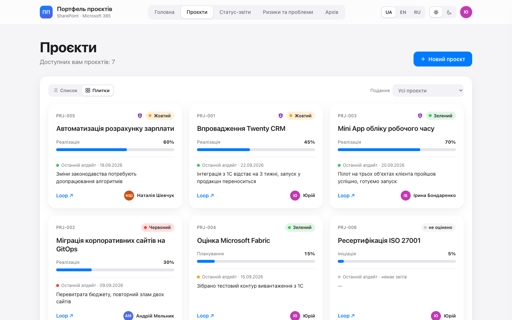
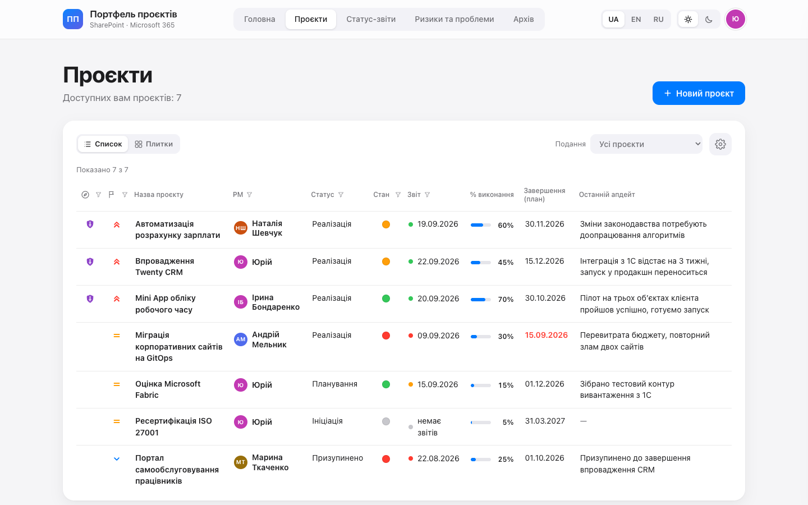
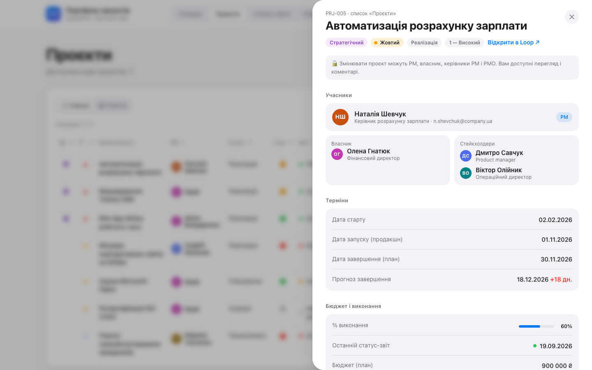
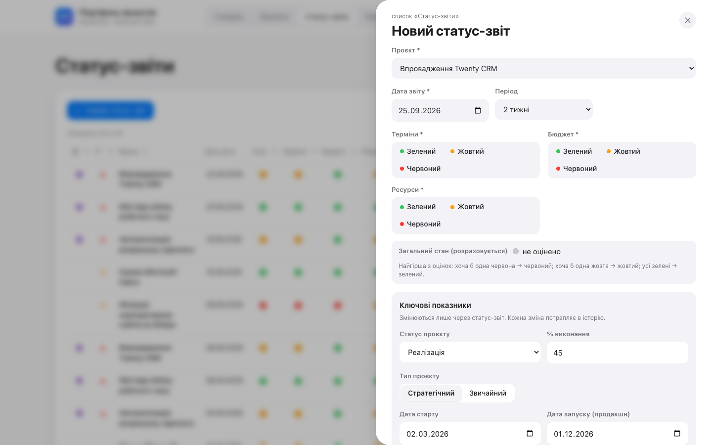
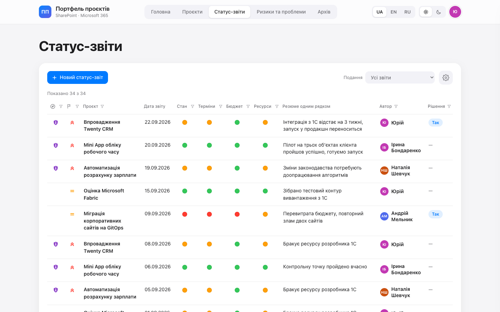
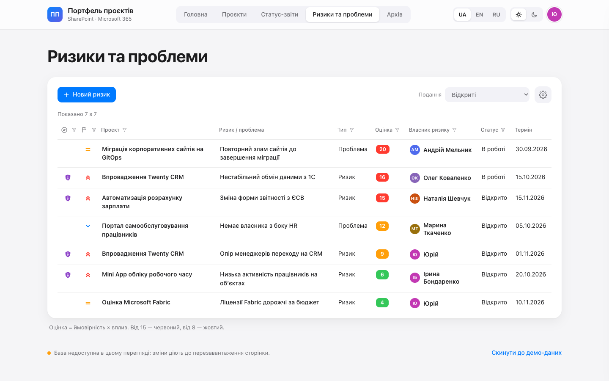
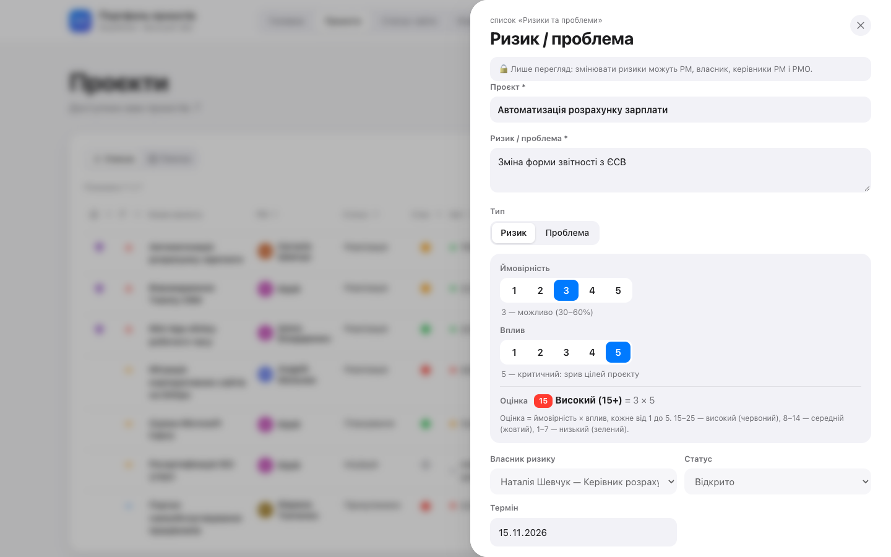
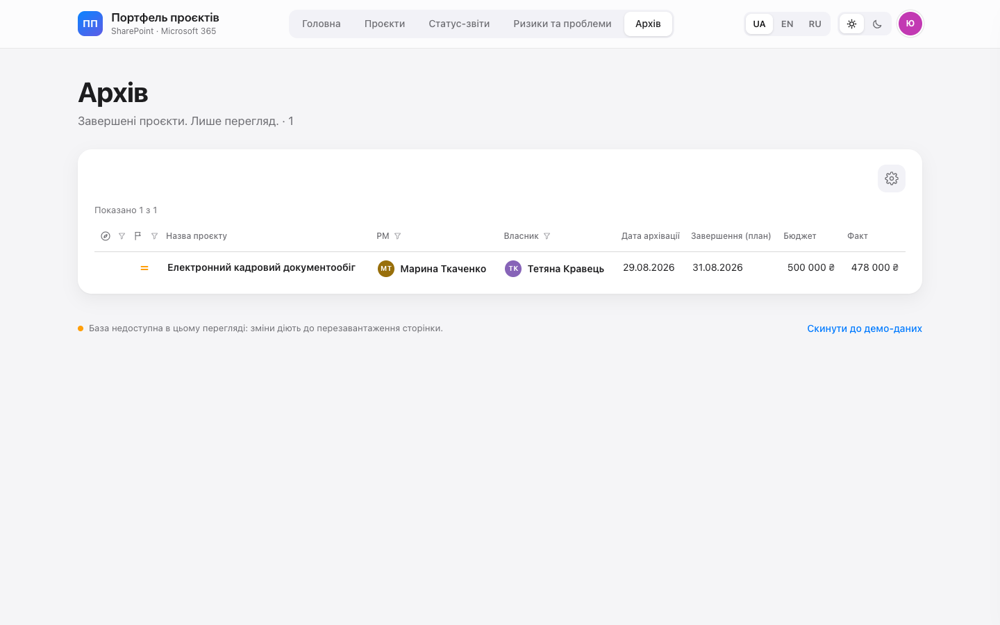
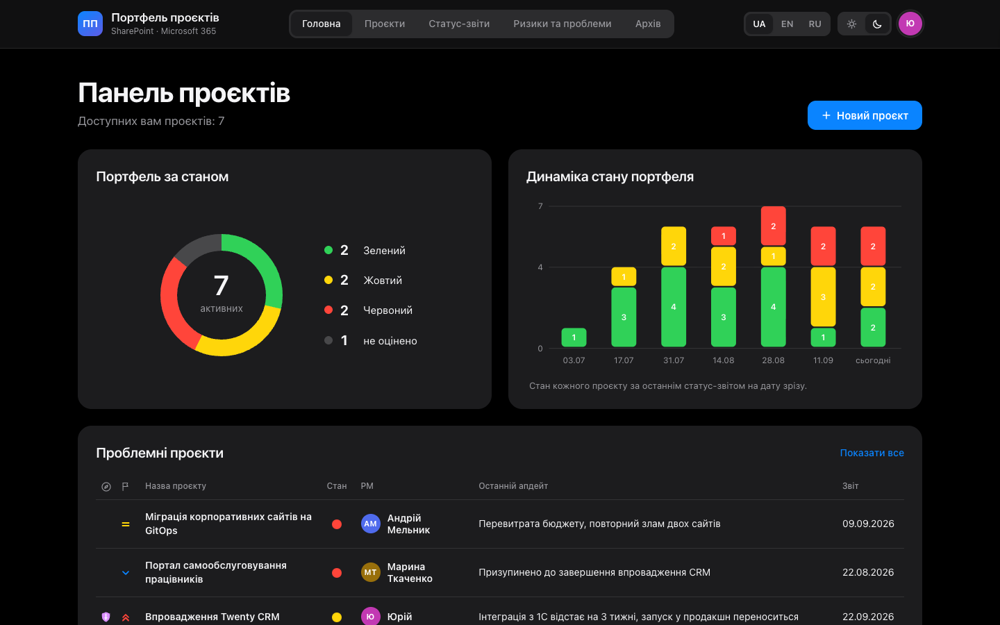

# Прототип интерфейса

[`prototype/pmo-prototype.html`](../prototype/pmo-prototype.html) — интерактивный прототип портала в одном HTML-файле, без зависимостей. Это эталон UX и техническое задание для приложения SPFx ([SPEC.md](SPEC.md)): экраны, тексты на трёх языках (словари `T` и `FLD`), цвета и размеры (CSS-переменные), правила расчёта.

## Как открыть

Двойной щелчок по файлу — откроется в браузере. Или локальный сервер:

```bash
cd prototype && python3 -m http.server 8765
```

Затем `http://127.0.0.1:8765/pmo-prototype.html`. Данные прототипа — демонстрационные, живут в памяти страницы; кнопка внизу страницы сбрасывает их к исходным.

## Что можно проверить

- новый проект, редактирование карточки;
- статус-отчёт с изменением показателей и обязательной причиной;
- «Завершено» → проект в архиве;
- риск с живым расчётом оценки;
- комментарий;
- «увійти як інший користувач» — как видят портал PM, собственник, стейкхолдер, посторонний (только в прототипе);
- светлая и тёмная темы, UA / EN / RU.

## Экраны

**Головна** — сводка портфеля, динамика, проблемные проекты, проекты без свежего отчёта, запросы на решение, открытые риски.


**Проєкти — плитки**



**Проєкти — список** с выбором колонок, сортировкой и фильтрами



**Карточка проекта** в выдвижной панели



**Новий статус-звіт** — подстановка текущих показателей и живой расчёт общего состояния



**Статус-звіти**



**Ризики та проблеми** и форма риска





**Архів**



**Тёмная тема**



## Что из прототипа не переносится в приложение

Только для демонстрации: «увійти як інший користувач», справочник сотрудников `ORG`, демо-данные и кнопки их загрузки, индикатор источника данных, хранение данных в странице или базе артефакта (`window.claude`). В приложении люди — из каталога Microsoft 365, данные — в списках SharePoint, права — фактические.

## Как меняется прототип

Прототип меняется вместе с приложением: одно требование не должно жить только в одном месте. Стили приложения генерируются из прототипа: `spfx/tools/extract-prototype.mjs` → `spfx/src/webparts/pmoPortal/theme/prototype.scss`. Скриншоты в `docs/img/` сняты с прототипа (светлая тема, UA) в Chrome.
